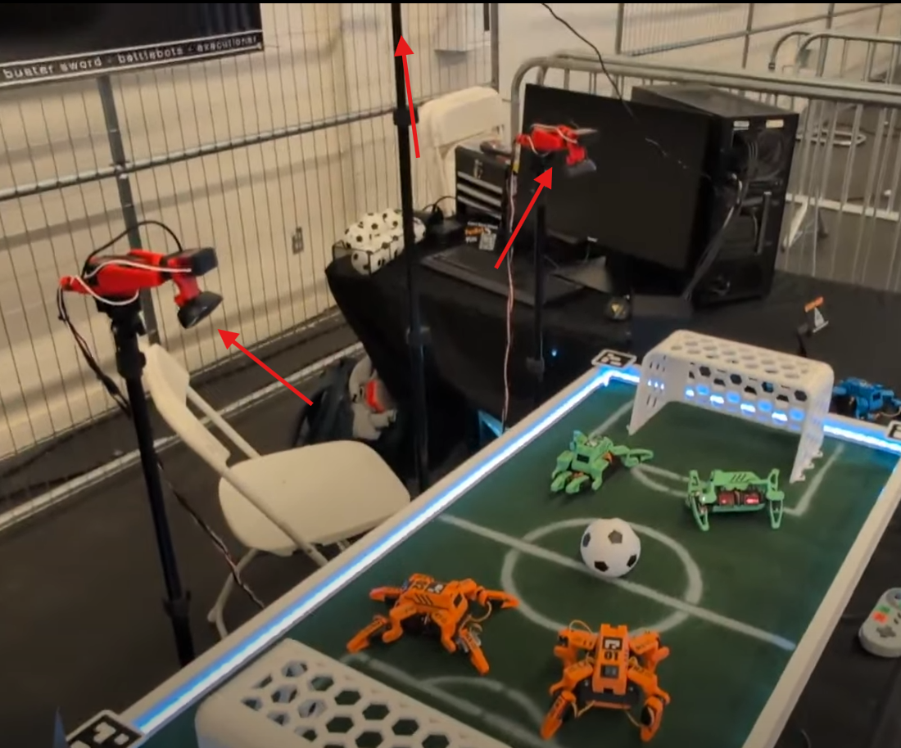
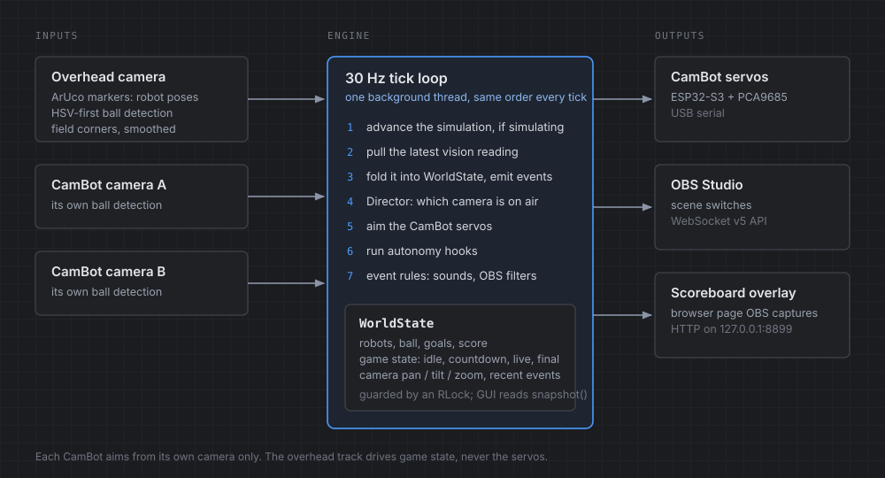
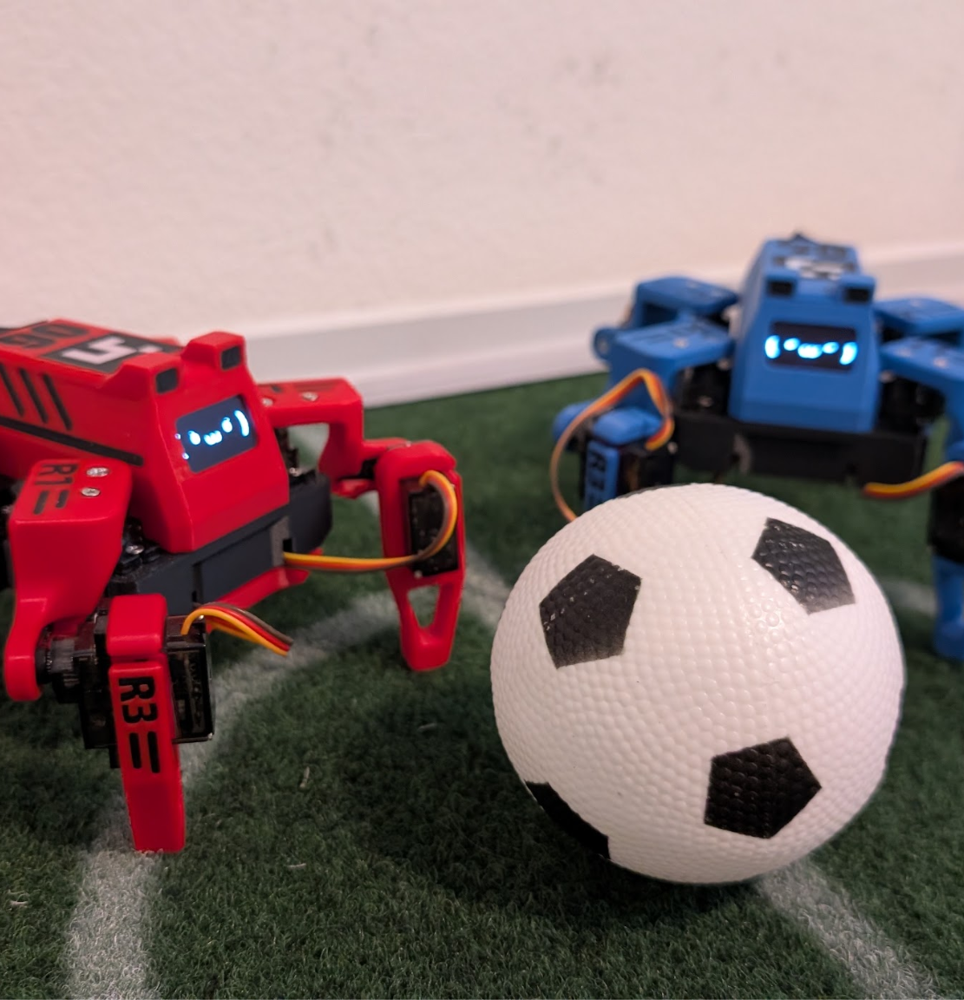

## Why automate the cameras

I built a robot soccer field. Then I discovered the boring truth about robot soccer: the matches are fun to *be at* and nearly unwatchable on video. One fixed camera in the corner of the room turns a fast, scrappy game into eight indistinguishable dots milling around a beige rectangle. The interesting thing is always happening somewhere the camera isn't pointed.

The obvious fix is a camera operator. The problem with a camera operator is that it's me, and I'd rather be running the match.

So I wrote Auto Producer: a single Python process that watches the field, physically aims two pan-tilt cameras at the ball, decides which camera should be on air, tells OBS to cut to it, and renders the scoreboard, with nobody in the chair. It's about 8,500 lines across 26 files, and it has taught me more about control loops and the gap between "the math says" and "the servo does" than anything else I've built.

> [!SPONSOR] bambu
> Live Robot Soccer is sponsored by Bambu Lab. Everything on the field that isn't a camera or a circuit board, from the robots to the CamBot rigs, came off a 3D printer, and fast, reliable printing is what let me iterate on a rig like this in days instead of weeks.
>
> 

## System architecture

There are three inputs. A fixed overhead camera looks straight down at the field and does two jobs: ArUco marker tracking for the robots (each bot wears a marker; the roster maps marker IDs to bots, teams, and colors) and ball detection. Two pan-tilt rigs, which I call CamBots, sit at field level and each run their own independent ball tracking on their own camera feed. The field itself is 121.92 by 60.96 cm, which is a very precise way of saying 48 by 24 inches.

There are three outputs. Servo pulses go out over USB serial to an ESP32-S3 driving a PCA9685, which aims the CamBots. Scene switches go to OBS Studio over the WebSocket v5 API. And a local HTTP server on `127.0.0.1:8899` serves a browser-based scoreboard and program overlay that OBS captures as a source.

In the middle is one object. `WorldState` holds the robots, the ball, the goals, the score, the game-state machine (idle → countdown → live → final), the pan/tilt/zoom of every camera, and a bounded deque of recent events. Everything reads and writes through it behind an `RLock`, and the GUI gets a `snapshot()`, a plain dict copy, so it can render without holding the lock while tkinter does its thing.

The engine is a 30 Hz tick loop on a background thread, and each tick does the same seven things in the same order: advance the simulation if we're simulating, pull the latest vision reading, fold it into world state (which spits out events: kicks, goals, ball-near-goal), ask the Director whether to change cameras, aim the servos, run the autonomy hooks, and evaluate the event rules that fire sound effects and OBS filters. Every subsystem that owns blocking I/O, meaning each camera capture, the serial links, and the HTTP server, gets its own thread. No `asyncio` anywhere. For a fixed-rate loop that spends its life waiting on `cv2.VideoCapture.read()`, threads were the boring correct answer.

The single most useful architectural decision was making every backend independently simulatable. Each module checks `config.simulate(module)`, a tri-state that falls back to a master simulation flag, and if a real backend fails to initialize it logs why and drops into simulation rather than dying.

## Ball tracking

Everything downstream, including where to aim, when to cut, and whether that was a kick, depends on knowing where the ball is. I assumed this was solved. It's 2026; you point YOLO at it and move on.

YOLO could not see my ball. Measured on this rig's actual cameras, the COCO-pretrained model's *best* confidence on the ball was about 0.07, against a detection threshold of 0.3. It's not a mystery why: COCO's "sports ball" class is full-size balls in real-world photographs, and mine is a small matte ball on a toy field under room lighting. The model wasn't wrong, it was out of distribution.

Meanwhile the thing I'd written as a placeholder, an HSV color threshold plus a roundness check, found the ball reliably and took about a millisecond.

So the hybrid detector runs HSV *first*, every frame, and only gives YOLO a shot when HSV comes up empty. It looks backwards in the code, running the dumb detector ahead of the smart one, which is exactly why the reasoning is written into the docstring rather than left for future-me to rediscover.

The HSV path did need one non-obvious fix. A matte ball never reads as one uniform color once it's lit, because there's a shadowed side and a bright highlight, and a fixed brightness floor is wrong in both directions: too strict on a dim frame, and on a bright one it lets in background glare. The floor is now Otsu's threshold computed per frame over the low-saturation pixels, clamped to stay inside the range that was calibrated as plausible. The camera's own exposure drift stops mattering.

## Debugging robots jumping across the field

For a while, robots and the ball would appear to jump across the field between frames. Worse, the event system was watching for speed spikes to detect kicks, so these jumps registered as absurd kick events and the director would cut cameras for a kick that never happened.

The cause was the homography. Four ArUco markers sit at the field corners, and I was solving the perspective transform fresh every frame from their detected corner pixels. ArUco corner detection has a pixel or two of jitter, which is nothing, until you feed it into a homography on a 120° FOV lens and extrapolate to points far from the corners, where a couple of pixels of input noise becomes centimeters of output error.

The obvious fix is to smooth the output positions. That's the wrong fix: it lags real ball motion, and real ball motion is the whole point. The corners, on the other hand, are *bolted to a table*. They have no genuine motion to lag. So the smoothing goes on the corner pixel inputs, an EMA at 0.85, and the output stays as responsive as the ball actually is.

While I was in there I added a check for the failure mode that had cost me the most time on the real rig: physically swapping two corner markers. The symptom is field coordinates that are wildly, confusingly wrong, and the fix takes ten seconds once you know. So the code walks the four corners in configured order and tests whether the resulting quadrilateral self-intersects. If the markers are swapped you get a bowtie, and it says *"Corner markers 2/3 look swapped"* instead of letting you stare at nonsense numbers.

## CamBot aiming: servo error vs the math

Aiming the CamBots is the one part of this that's a real control problem, and it's where I most enjoyed being precise and most enjoyed being wrong.

The first version fed the overhead camera's ball position into the pan-tilt aim, which is the obvious design: you have a top-down view of the whole field, so use it. It made the rigs slew wildly. The overhead track is noisy at the edges, and a noisy setpoint on a servo with real momentum is a machine that hunts. Now each CamBot aims using *only* its own camera's ball detection, a closed-loop visual servo, and the overhead track is dropped from aiming entirely. It's still the source of truth for game state. It's just not allowed near the servos.

For the motion profile, I sat down and derived the relationship: for a step of size *d*, the profile overshoots if `max_accel < tracking_gain × max_speed / 2`. I verified it in simulation up to a 180° step, added a 25% margin, and shipped those as the defaults: gain 30, 2400 °/s, 12000 °/s².

The config on the actual rig runs 1600 °/s and 8000 °/s². About two-thirds.

I want to be clear that the derivation isn't wrong, and I wrote its own limits into the comment before I ever hit them. It's a software analysis, not a hardware one, and it assumes the real servo can execute the commanded speed and acceleration with no extra lag or backlash. Real servos have both. The paper number was the ceiling; the real number was found by watching two cameras twitch at a ball and backing off until they stopped.

There's a related decision I like more than the control law. There are no ultrasonic sensors in the goals. I tried to spec them and couldn't find a way to make one distinguish a ball sitting in the goal mouth from a robot parked there. Goals are detected from the ball's tracked field position instead. Sometimes the sensor you don't add is the design.

## Known issues

Two things are honestly wrong with it. The OBS scene switch happens synchronously inside the tick, while holding the engine lock, which means a hung OBS connection stalls the whole 30 Hz loop. It should be queued to its own thread. And there is no automated test suite at all: every file with "test" in the name is an interactive calibration panel or a hardware bring-up script. For a system where I can't reproduce most failures without the physical rig, the simulation mode is doing a lot of load-bearing work that a handful of actual unit tests should be doing instead.

The thing I keep coming back to, though, is that almost none of the hard-won parts of this project were the parts I expected to be hard. I budgeted my worry for the servo control loop and the OBS integration. What actually ate the time was a matte ball that YOLO couldn't see, two pixels of jitter on a corner marker, and a physically swapped sticker.

## Watch the video

See this tech in action, my engineering process, and more in the full length YouTube Video!

https://www.youtube.com/watch?v=EnNQ4rIJpO0
