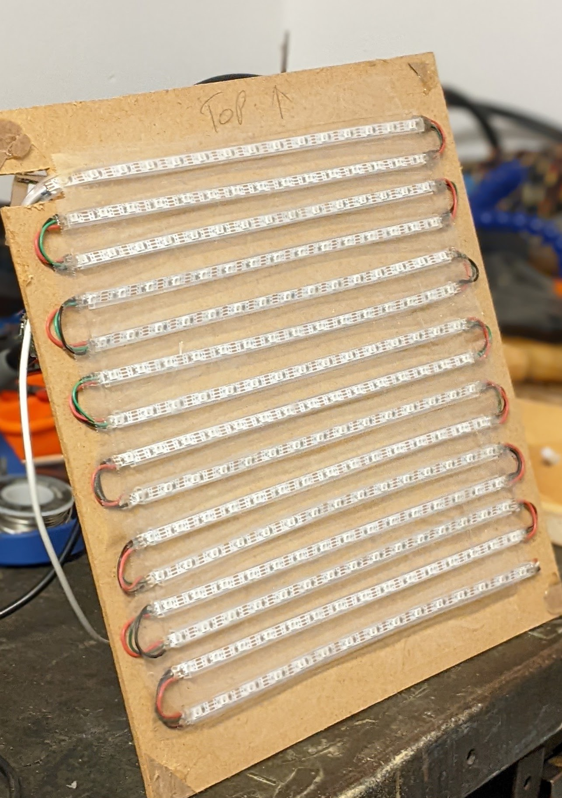
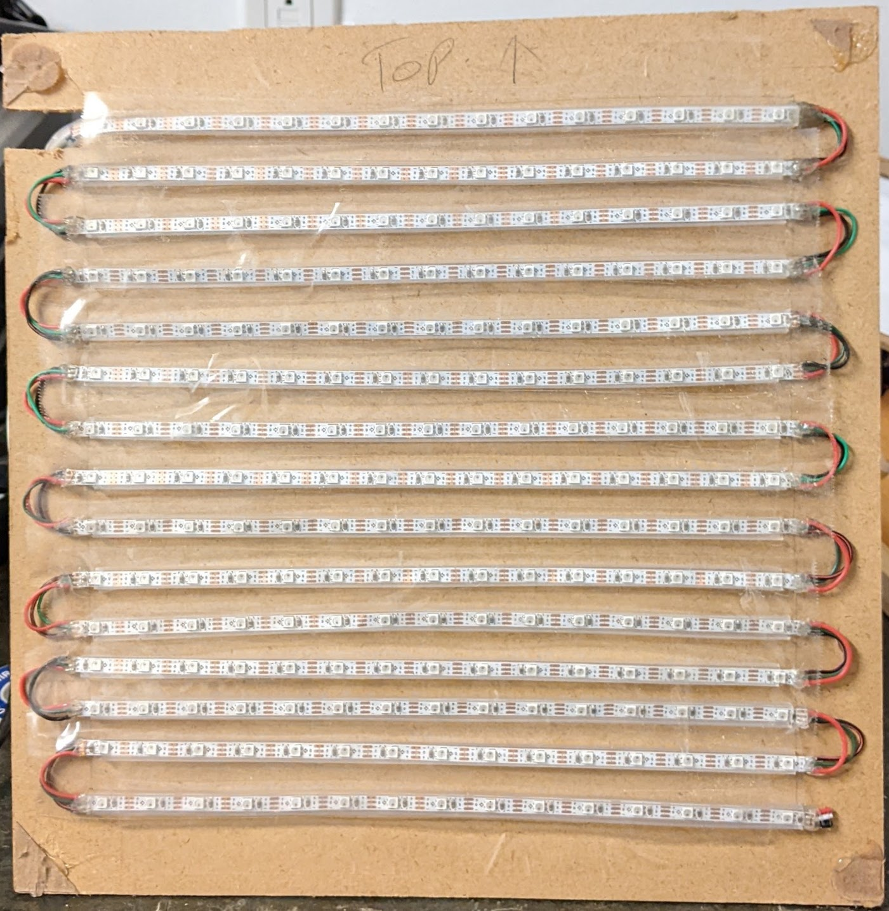
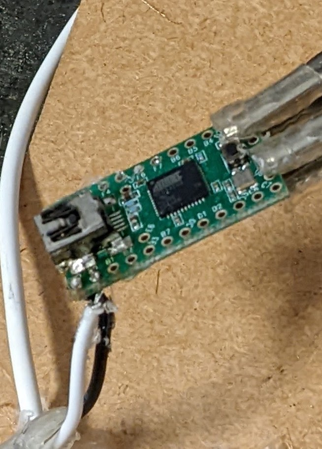
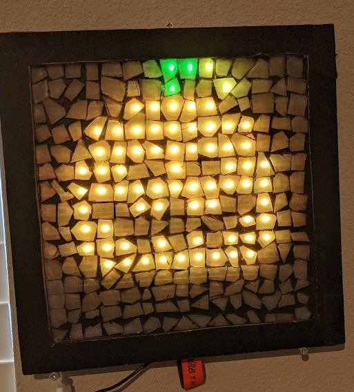

## What is a digital mosaic?

A digital mosaic is a captivating art form that combines the charm of traditional mosaics with the versatility of digital technology. It consists of a grid-like screen, typically with a low fidelity resolution like 15x15 pixels, where each pixel acts as a small shard. These shards work together harmoniously to create a visually stunning mosaic effect.

In its essence, a mosaic is an artistic composition formed by assembling colored pieces of glass, tiles, or other materials to form a cohesive image. With the digital mosaic, this concept is taken to new heights. By assigning a unique color to each individual tile or shard, intricate and captivating images can be meticulously crafted.

Using Canvas we are able display anything on this screen, from clocks, to GIFs, to even screen sharing live. In fact, anything that fits onto a 15x15 canvas can be displayed, and at 60fps!

For example, when working on making examples, we created a randomised rainbow plasma effect, with trillions of combinations. Each one runs at 60fps and can be mesmorising to look at.

## Creating the mosaic

When we started, it was for a school project! The task was to make a mosaic style art piece and to be creative about it. I thought it would be boring if it was just one image, so I made it infinite images!

To start, we researched some addressable multi color LED strips that would work for the job, We found the Adafruit NeoPixel LED strips were more than adequate and provided all criteria needed.

Then we started development on the LED display. Using a Teensy and a Raspberry Pi, we eventually had a rough grid of LEDs that worked and displayed stuff.

## Future plans

The dynamic mosaic project is continuously evolving, and it would greatly benefit from your contribution! The entire codebase is open source and accessible on GitHub, granting you the freedom to explore and personalize it as you see fit. Moreover, the mosaic itself has seamlessly settled into my living space, now serving as an elegant and captivating room clock.

It was also exhibited at [Maker Faire 2020](https://makerfaire.com/maker/entry/71367/).

https://www.youtube.com/watch?v=WTFL9O1J2mQ
