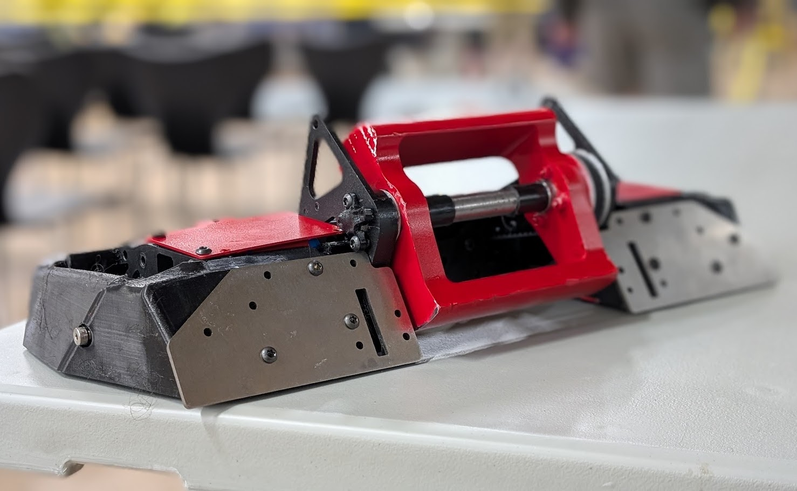
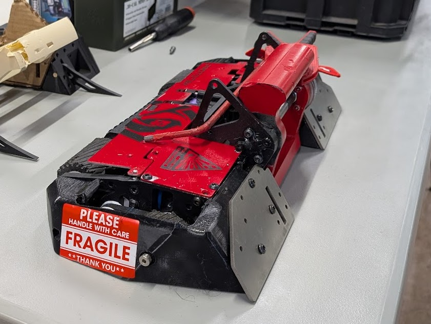
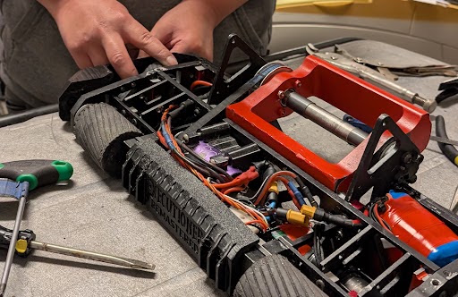
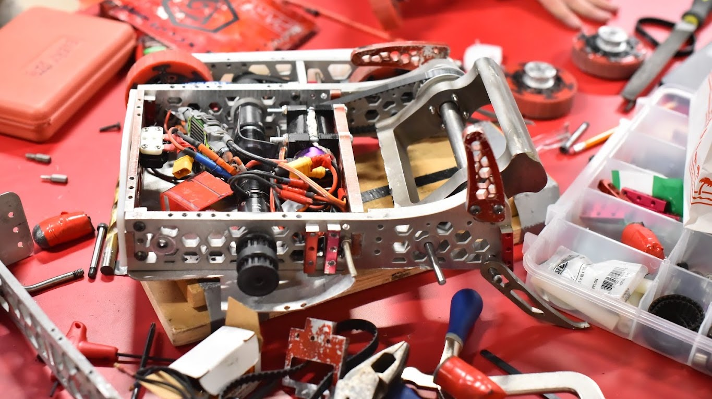
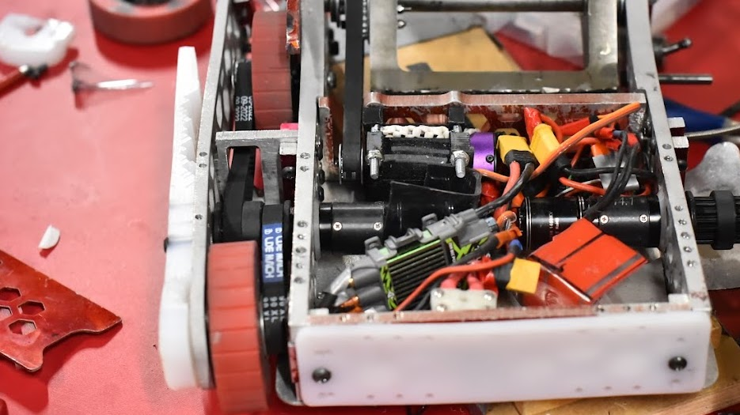
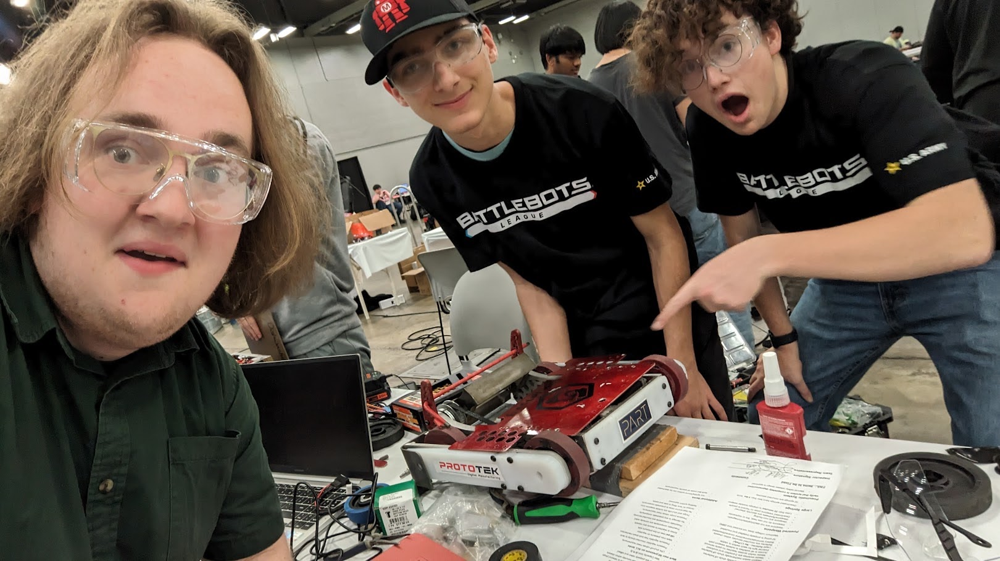
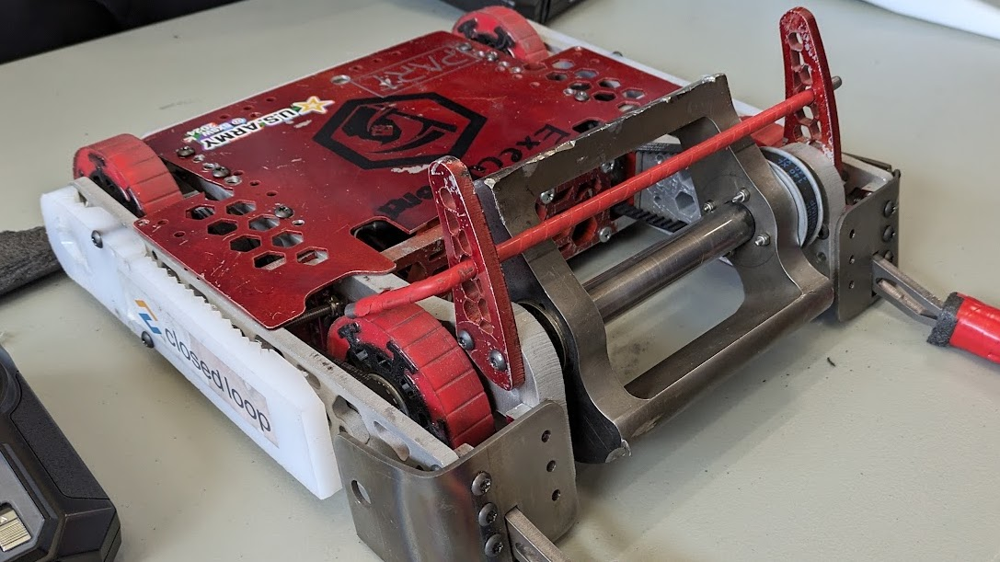

## Quick overview

-   [This Robot was Designed to Destroy: NRL Nats 2025](https://www.youtube.com/watch?v=kG9CeR6zm20)
-   [Executioner Goes to Sac Bot Battles 2024](https://www.youtube.com/watch?v=DZ6EpWjpJHM)
-   [Executioner Goes to BattleBots Metal Mayhem at SXSW 2024](https://www.youtube.com/watch?v=XNexpGfW4VQ)

The Executioner project represents an evolving endeavor in combat robotics, initiated by a team of student engineers and continued under the lead of Dorian Todd. Through two major iterations—Original Executioner and Executioner Remastered—our team has designed, built, and competed with cutting-edge combat robots, learning and innovating with each challenge.

## Team

| Role | People |
|---|---|
| Team captain | Dorian Todd |
| Current team | Chase Chiang, Nathan Valdez, Luke Williams |
| Past team | Colin Malone, Ty Snyder |
| Affiliation | Placer Advanced Robotics and Technology (PART) |

## Executioner Remastered

*2025 to present*

Executioner Remastered represents a comprehensive redesign based on lessons learned from the original model. While retaining the proven asymmetrical vertical spinner concept, we completely reimagined the chassis and drive system.

### Key inspirations

-   Heavily inspired by the BattleBot "Manta," particularly its rear-drive configuration

-   Wide-body architecture exceeding 2 feet in width for enhanced maneuverability

-   Design focused on improved gyroscopic stability (manifesting as lifting rather than flipping under high weapon RPM)

Every component of Executioner Remastered tells a story of iteration. With over 300 design versions and 130+ hours in Fusion 360, this isn't just a robot—it's a testament to relentless engineering pursuit.

### New improvements

-   Replacement of drive ESCs with Vortex 80A units (rated for 6S)

-   Enhanced insulation for all bullet connectors

-   Proper installation of all drive ESC components, including input capacitors

-   Addition of metal forks to address performance issues

## The Executioner

*2023 to 2024*

The Original Executioner was a 15-pound combat robot designed and built by me and a team of peers under Placer Robotics, based in Roseville, California, with backing from the nonprofit Placer Advanced Robotics and Technology (PART). The robot was created for the 2024 BattleBots: Metal Mayhem competition at South by Southwest (SXSW) in Austin, TX.

The robot featured a four-wheeled, indirect drive chassis, providing it with both stability and mobility in the arena. Its primary weapon was a front-mounted, asymmetrical eggbeater-style spinner—an over-4-pound bar that reached speeds of 11,000 RPM (249 mph tip speed). The weapon was designed for massive kinetic energy transfer and was powered by two brushless motors. Titanium corner pieces and integrated steel forks helped funnel opponents directly into the weapon's strike zone. Large metal “horns” on either side of the weapon allowed it to remain fully functional while inverted.

The Original Executioner began its competitive career with a challenging run at BattleBots Metal Mayhem. In the group stage, it went winless, facing mechanical issues including a detached baseplate. However, it rebounded in the single-elimination bracket, where it launched one opponent into the arena wall and later engaged in a back-and-forth match that ended with a knockout in the center of the arena.

Following Metal Mayhem, the Original Executioner competed at Sacramento Bot Battles. It secured a knockout win against Free Hugs before losing a judge's decision to Lunar Eclipse and later being eliminated by Queen of Hearts in the losers’ bracket.

Its development involved intensive CAD modeling in Fusion 360, hands-on fabrication, and iterative problem-solving. The build process emphasized team coordination, time management, and real-world application of mechanical design principles. The Original Executioner stood as a fully invertible, high-speed vertical spinner and served as a foundational project in the team's growth in competitive combat robotics.

