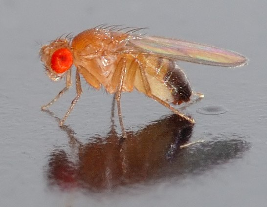
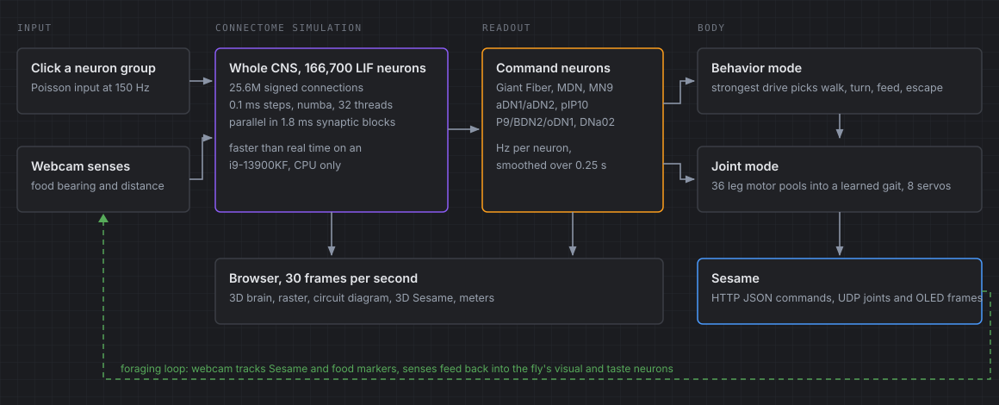
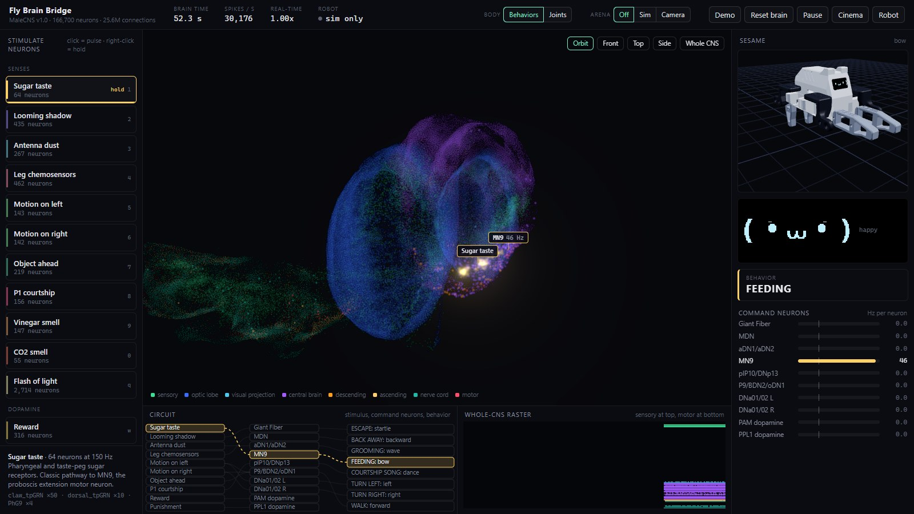
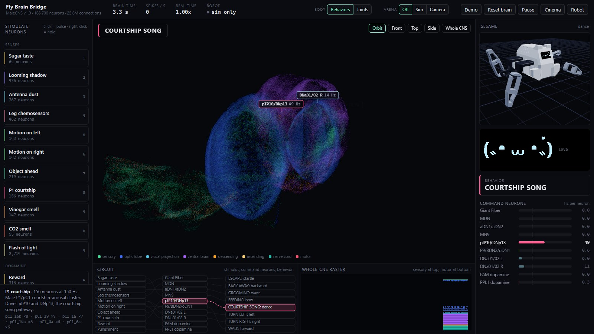
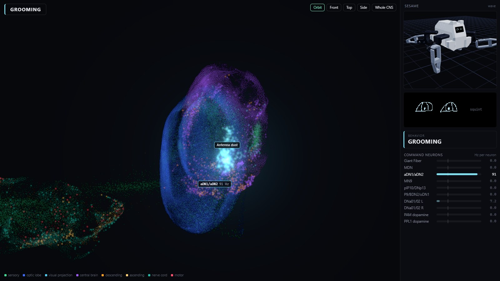
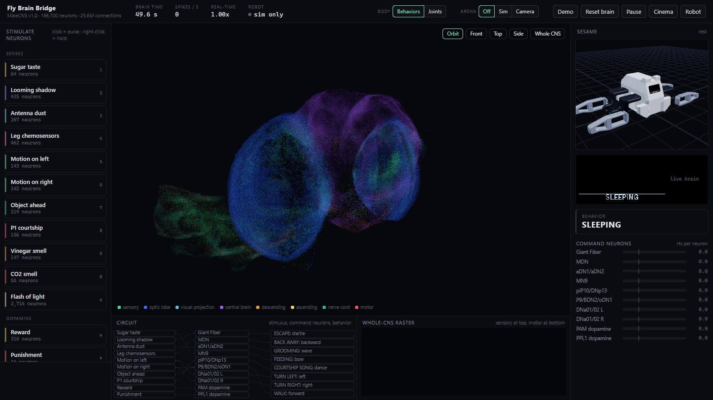
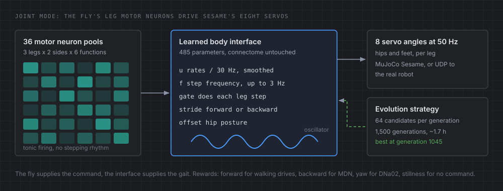
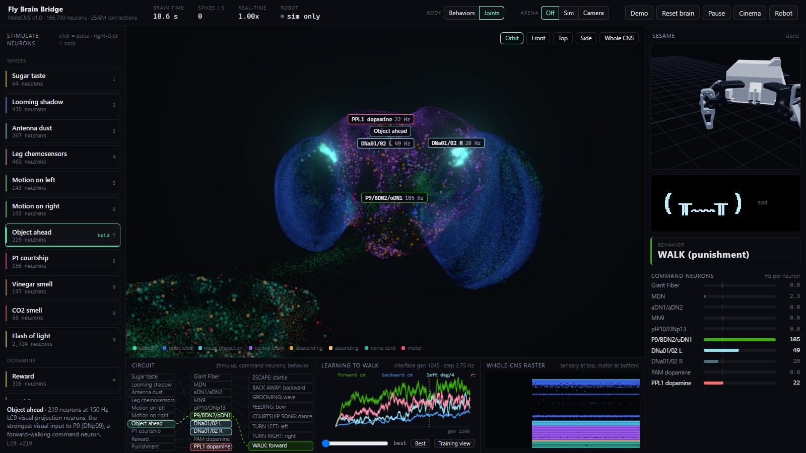
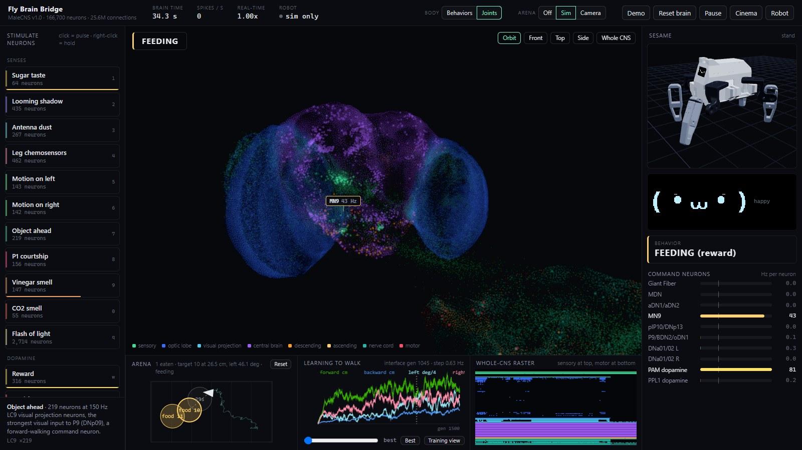
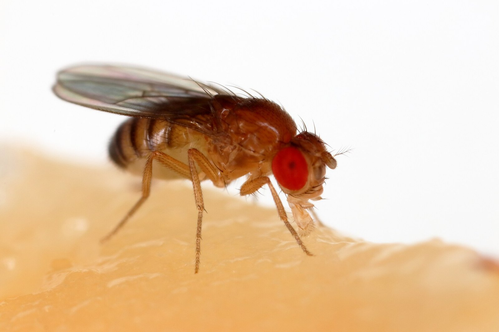

What happens if you take an entire fruit fly brain, neuron by neuron, and give it a robot body?

Not a neural network that is "inspired by" a brain. The actual wiring diagram of a real *Drosophila* nervous system, every one of its 166,700 neurons and 25.6 million connections, simulated spike by spike on my desktop. You poke a group of identified neurons, like the sugar taste receptors on the fly's mouthparts, the signal travels through the fly's real wiring, and whatever the fly's own command neurons decide to do, [Sesame](/sesame) does.

Show it a looming shadow and the Giant Fiber fires and Sesame jumps. Put "sugar" on its proboscis and MN9 fires and Sesame bows down to eat. Dust its antennae and it grooms. Tickle the courtship neurons and it dances.

This is the long version: where the data came from, how I got 166,700 neurons running in real time on a CPU, the part where the brain would not stop screaming, and how I eventually taught the fly's leg motor neurons to walk a robot that has four legs instead of six.

## The data: MaleCNS v1.0 connectome



The fruit fly is the most completely mapped brain we have. In 2026, Janelia's FlyEM team, together with the University of Cambridge, the MRC Laboratory of Molecular Biology and Google Research, released [MaleCNS v1.0](https://www.janelia.org/project-team/flyem/male-cns-connectome): an electron microscopy reconstruction of an entire adult male fly central nervous system. The brain, the optic lobes, and the ventral nerve cord that runs down into the body and controls the legs. Every neuron traced, every synapse counted, released under CC BY 4.0.

Before writing any code I went through the recent "fly brain plays games" projects (DOOMFLY, Fly64, NeuroCraft Fly, Fly/Wirehead) and Eon Systems' embodied fly write-ups. All of them use a connectome like MaleCNS or FlyWire with a leaky integrate-and-fire model based on [Shiu et al. 2024](https://www.nature.com/articles/s41586-024-07763-9), the Nature paper that showed a connectome-only model of the fly brain can predict real sensorimotor behavior. That became my starting point.

I downloaded three files from Janelia's public bucket:

| File | Size | What it holds |
|---|---|---|
| Body annotations | 13 MB | One row per neuron: cell type, superclass, side, soma location, synonyms |
| Neurotransmitters | 42 MB | Predicted transmitter for every neuron |
| Connectome weights | 1.1 GB | 151.9 million rows of (presynaptic, postsynaptic, synapse count) |

The annotations turned out to be a goldmine. Cell types carry their literature names as synonyms, so I could find the famous neurons directly: DNp01 is the Giant Fiber, the fly's escape neuron. MDN is the Moonwalker Descending Neuron that makes flies walk backward. MN9 extends the proboscis to feed. Leg motor neurons are even named after the muscle they drive.

## Preprocessing the connectome

I kept every body with an assigned superclass, which is 166,700 real neurons, the same convention DOOMFLY and Fly64 use. Signs come from neurotransmitters, following Shiu: GABA, glutamate and histamine are inhibitory, everything else is excitatory. Acetylcholine dominates with 103,720 neurons.

Keeping only edges between retained neurons leaves 25,582,938 directed connections, stored as a sparse matrix of signed synapse counts. The whole preprocessing step takes about 10 seconds.

For the viewer I needed a 3D position for every neuron. Most have a soma location, but about 26,000 (mostly sensory neurons entering from outside the brain) do not. Those get placed at the synapse-weighted average of their already-placed partners, repeated three times, which places all but 212. One fun bug: my first version flipped only the y axis, which mirrored the whole brain. I caught it by checking which side the left optic lobe neurons actually ended up on.

## Neuron model: leaky integrate-and-fire

Each neuron is a leaky integrate-and-fire unit, exactly the Shiu model. Voltage leaks back toward rest, a synaptic conductance decays, and when voltage crosses threshold the neuron spikes, resets, and sits refractory for 2.2 ms. Every spike adds its synapse count times a weight to each target, after a 1.8 ms synaptic delay.

```text
dv/dt = (v0 - v + g) / t_mbr        v0 = -52 mV, threshold -45 mV, t_mbr = 20 ms
dg/dt = -g / tau                    tau = 5 ms
spike: v = v_rst, g = 0, refractory 2.2 ms
each presynaptic spike adds synapse_count * sign * w_syn to g, 1.8 ms later
```

Stimulation is virtual optogenetics: a clicked group gets Poisson input at 150 Hz, and each event is strong enough to make the neuron fire.

Here is a single neuron running that exact model. Each blue tick along the bottom is an input spike from one presynaptic partner. Try the three weight presets, and push the synapse count up toward 264 to see why one of the fixes below was a cap.

<div class="widget" data-widget="lif"></div>

## Running 166,700 neurons in real time on a CPU

My first engine was a serial numba loop that only updated neurons away from rest. Sugar stimulation ran at 0.20x real time, because activity spread so broadly that around 155,000 neurons were active anyway.

The trick that fixed it was hiding in the model itself. **Every synapse has the same 1.8 ms delay, which is exactly 18 time steps.** Nothing a neuron does inside an 18 step block can affect any other neuron until the next block. So each block can be computed completely in parallel:

1. **Route:** scatter the previous block's spikes into per-step input rows. The sparse rows are sorted, so each thread binary-searches just the slice of targets that land in its own chunk of neurons.

2. **Integrate:** every thread runs all 18 steps for its chunk of neurons, skipping ones sitting at rest.

3. **Collect:** count spikes and hand them to the server.

That took it to 1.4x real time on 32 threads at around 360,000 spikes per second, with results statistically identical to the serial version. The calibrated model below is quieter and runs faster than real time, so the server paces it to the wall clock: 18 blocks per frame, about 30 frames per second of brain.



## Debugging runaway activity that never stopped after a stimulus

This was by far the hardest part of the project, and sooo much more interesting than I expected.

With Shiu's parameters on the full MaleCNS, almost any stimulus pushed the network into self-sustaining activity that never stopped. Poke it once and it kept firing at around 370,000 spikes per second forever, sometimes flipping into a runaway state of one to two million. A robot controlled by that brain would keep feeding or grooming until the battery died.

I tested every fix the same way: stimulate each group, check that the known target neurons still respond, then measure what is left 1.5 to 2.5 seconds after the stimulus ends.

**Adaptation made it worse.** Adding a spike-frequency adaptation current caused oscillatory bursting, because inhibitory neurons adapt too, which disinhibits everything else. Adapting only excitatory neurons killed the real sugar to MN9 response.

**No single cell type was to blame.** Silencing candidates one at a time just flipped the network between different persistent states. The persistence was distributed.

**Lowering the synaptic weight helped.** MaleCNS counts every synapse at a 0.5 confidence threshold, so per-connection counts run higher than the FlyWire data Shiu tuned on. At w_syn 0.15 the targets still respond and sugar no longer persists. At 0.1 the sugar pathway dies.

**Neuromodulators are not fast transmitters.** Many odors still fell into an attractor where about 300 PAM dopamine neurons fired at 130 Hz. In the real fly, dopamine, serotonin and octopamine act slowly, so I removed their fast synaptic output.

**The mushroom body and antennal lobe.** The remaining loop lived in Kenyon cell to Kenyon cell connections and cholinergic antennal lobe local neurons, much of whose real excitation is electrical coupling. Removing those dropped leftover activity from about 225,000 to under 30,000 spikes per 500 ms.

**The grooming loop.** I only found the last one while building the Demo button. After an antenna dust stimulus, the grooming neurons kept firing at 123 Hz forever. A silencing screen found a dense excitatory cluster in the subesophageal zone where single connections carry up to 264 synapses. That is roughly 40 mV per spike against a 7 mV gap to threshold. Capping every connection at 100 synapses fixed everything: zero persistence, and all 18 input pathways still work. Real postsynaptic responses saturate anyway, so the cap is defensible.

After those five edits, the brain falls completely silent within about a second of any stimulus ending, and it still reproduces the textbook circuits. Step through the fixes yourself, and compare the caps I screened:

<div class="widget" data-widget="calibration"></div>

## Mapping stimuli to command neurons

For every candidate stimulus group I held it on for 1 to 1.5 seconds and recorded every candidate readout. Candidates came from the literature and from connectivity. For example, the strongest inputs onto the Giant Fiber are LC4 with 6,362 synapses and LPLC2 with 4,862, exactly the looming detectors you would expect.

| Stimulus | What fires | Sesame |
|---|---|---|
| Sugar taste (PhG9, taste peg GRNs) | MN9, about 45 Hz | Feeding: bow |
| Looming shadow (LC4, LPLC2, LC6) | Giant Fiber, about 380 Hz | Escape: startle |
| Antenna dust (Johnston's organ) | aDN1/aDN2, about 94 Hz | Grooming: wave |
| Leg chemosensors (ppk23/ppk25) | MDN, about 50 Hz | Back away |
| Motion on left or right (LLPC1) | DNa01/02 on that side, about 113 Hz | Turn |
| Object ahead (LC9) | P9, BDN2, oDN1, about 109 Hz | Walk forward |
| P1 courtship neurons (pC1) | pIP10, DNp13, about 171 Hz | Courtship: dance |

A nice validation: stimulating LC10a, the visual neurons males use to track females, drives steering on the same side plus the courtship song neuron pIP10. That is a known result from real flies, and it fell straight out of the wiring.





## Behavior controller



Every frame, spikes in each readout group become Hz per neuron, smoothed over 0.25 seconds. Each behavior has a readout and a threshold, and the behavior with the strongest drive wins. My first version used a fixed priority and misfired: antenna dust drove the grooming neurons at 152 Hz but also MDN at 39 Hz, and "back away" beat grooming. Scoring by how far each readout is above its threshold fixed it.

Walking and turning are held while their readout stays above half the threshold. Poses like bow, dance and startle lock the controller for exactly as long as the firmware takes to play them. After 45 seconds of nothing, Sesame lies down with a sleepy face.


## Robot API and firmware changes

Sesame already has an HTTP JSON API for movement, poses and faces, so behavior mode just sends commands over WiFi on a worker thread where the newest command always wins. A slow ESP32 never stalls the brain.

I also made a copy of the Sesame firmware with three additions:

- **A startle pose** for the Giant Fiber: two fast crouch and spring bounces, then a wide braced stance.

- **A live brain screen:** the PC renders a scrolling raster of the whole nervous system into a 128x64 frame and streams it over UDP, so the robot's own OLED shows its brain firing.

- **Joint streaming:** eight servo angles per UDP packet, with joint limits, a slew limit, and a watchdog that eases back to standing if packets stop for 300 ms.

## Web interface



The web UI is built for recording videos. The center is a 3D brain with all 166,700 neurons as glowing points at their real soma positions, colored by family, with floating labels on the command neurons showing live firing rates. On the right, a 3D Sesame built from the real printed parts and the Sesame Studio joint rig replays exactly what the firmware would do, with the OLED face beside it. Along the bottom there is an animated circuit diagram and a whole-CNS raster where sensory neurons sit at the top and motor neurons at the bottom.

There is a Demo button that walks through the main circuits one stimulus at a time: feeding, grooming, escape, walking, turning both ways, backing away and courtship, about 77 seconds in total. Running that Demo headless is what exposed the grooming loop above.

## Joint control: training a gait interface on leg motor neurons

Behavior mode is the fly choosing *what* to do. I wanted to go further and let the fly's actual leg motor neurons move the joints.

**The physics.** I used MuJoCo with the validated Sesame model from [lukehollis/sesame-ml](https://github.com/lukehollis/sesame-ml). Replaying the firmware's own gait sequences moves the simulated robot the same way as the real one, which gave me confidence the sim was worth training in.

**The motor neurons.** I grouped the fly's leg motor neurons by leg, side and muscle function into 36 pools: swing forward, swing back, lift, press down, tibia flex and tibia extend.

**The surprise: no rhythm.** Driving the walking command neurons produced clear, command-specific motor patterns. Left DNa02 excites the left middle and hind leg protractors, MDN excites the leg depressors. But none of it oscillates. Every pool's spectrum is flat. In a real fly, the stepping rhythm depends on sensory feedback from the legs and on cellular properties a point-neuron model simply does not have.

So the body interface contains a small central pattern generator whose every setting is a learned function of the motor neuron rates: step frequency, which legs step, stride direction and hip posture. It has 485 parameters, and the connectome is never changed. A sign bug nearly got me here too, and it took waaay too long to spot. Left and right hips are mirror images, so my hand-set "turn right" walked straight forward at 13 cm/s until I added a hip sign.




**Training.** Each episode plays 4 seconds of recorded motor neuron activity into the interface driving the simulated Sesame. Walking commands are rewarded for distance forward, MDN for distance backward, DNa02 for turning the right way, and "no command" for standing still, so the interface has to actually read the motor patterns instead of always walking. Friction, mass, servo speed and latency are randomized every episode. An evolution strategy with 64 candidates per generation ran 1,500 generations in about 1.7 hours on 24 worker processes.

**Results.** In a deterministic 4 second test the best interface, from generation 1045, gets every command right: +40 cm for the walk drive, +47 cm for object ahead, backward for MDN, +144 degrees for left DNa02 and -109 degrees for right DNa02, and nearly still with no command. Across randomized episodes it moves correctly 83 to 100 percent of the time, with one fall in 96 episodes.



## Population training: 256 robots on rough terrain

Then I made it harder. One 12 by 12 meter MuJoCo world with rolling hills up to about 12 degrees and small bumps, and 256 Sesames on it, each with its own grip, mass and servo speed. Every robot gets an arrow that changes direction every few seconds.

The fly perceives the arrow through a blend of its recorded motor neuron responses: arrow ahead mixes in the walking recording, arrow to one side mixes in that side's DNa02 recording. Training from the flat-ground interface for 300 generations raised the distance traveled along the arrows from 22 cm to 33 cm and the success rate from about 58 to 72 percent. Falls stayed around 5 to 9 percent, because I made the fall penalty too weak. Lesson learned.


## Webcam foraging with ArUco markers

The last piece closes the loop. A webcam looks down at the field and tracks ArUco markers, borrowing the tracking conventions from my [Live Robot Soccer](/projects/auto-producer) project: corner markers for the field homography, a marker on Sesame's head, and markers for food. No sensors are added to the robot.

The food becomes senses the fly understands:

- Food to the left recruits a fraction of the left LLPC1 motion neurons, food to the right the right ones.

- Food straight ahead recruits LC9 "object ahead" neurons.

- Distance drives the vinegar smell receptors.

- Arriving triggers sugar taste and the PAM reward neurons.

Nothing else steers. Turning and walking come entirely from the brain's descending neurons. In two-minute simulated runs a normal fly found 5 and 10 foods. A blind fly found 0 and just stood there. And a fly with its left and right eyes swapped found 0 while turning veeery confidently the wrong way, which is my favorite control result in the whole project.



The same logic, in your browser. Drop food anywhere on the field, then blind the fly or swap its eyes:

<div class="widget" data-widget="forage"></div>

## Limitations



- The neurons are point neurons: no dendrites, gap junctions, slow neuromodulation or learning, and neurotransmitter signs are predicted. I made five edits to stop reverberation, all described above.

- The connectome carries the signal from stimulus to command neurons, but the mapping from command neurons to Sesame behaviors is designed by me.

- Joint mode uses a learned oscillator because the model's motor neurons are not rhythmic. The fly supplies the command, the interface supplies the gait.

- The population view blends recorded motor neuron responses instead of running 256 live brains.

- The joint streaming firmware, brain OLED screen, startle pose and webcam tracking are built and tested in software, but not yet on the physical robot. Sim to real for the gait is the biggest risk, so the first real test will be with Sesame held in the air.

## Credits

- Connectome: [MaleCNS v1.0](https://www.janelia.org/project-team/flyem/male-cns-connectome), FlyEM at HHMI Janelia Research Campus, University of Cambridge, MRC LMB and Google Research, Berg et al., Cell 2026, CC BY 4.0.

- Neuron model: Shiu, P.K. et al., [A Drosophila computational brain model reveals sensorimotor processing](https://www.nature.com/articles/s41586-024-07763-9), Nature 2024.

- Physics model: Sesame MJCF and meshes from [lukehollis/sesame-ml](https://github.com/lukehollis/sesame-ml), Apache 2.0, running in [MuJoCo](https://mujoco.org/).

- Robot: [Sesame](/sesame), including Sesame Studio's joint rig and pose sequences.

- Photos: André Karwath and Sanjay Acharya on Wikimedia Commons, CC BY-SA.
