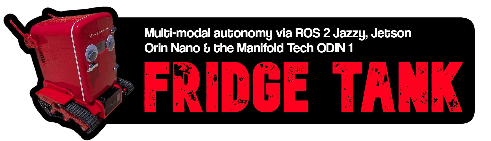

The pitch was simple enough that I could explain it in one sentence: a mini fridge that follows you around, or runs away from you, on its own.

**This was wayyyy easier said than done**. The actual build took me through a firmware version gate that bricked my progress for days, a soldering fault that cost me an afternoon of firmware debugging, a control loop that was quietly reacting to its own motion, and a perception pipeline that was running at 2.3Hz for reasons that had nothing to do with the thing I assumed was slow.

This is the long version. If you want the code, it is all up at [autonomous-tank-system](https://github.com/dorianborian/autonomous-tank-system) and I will link the relevant pieces as I go.

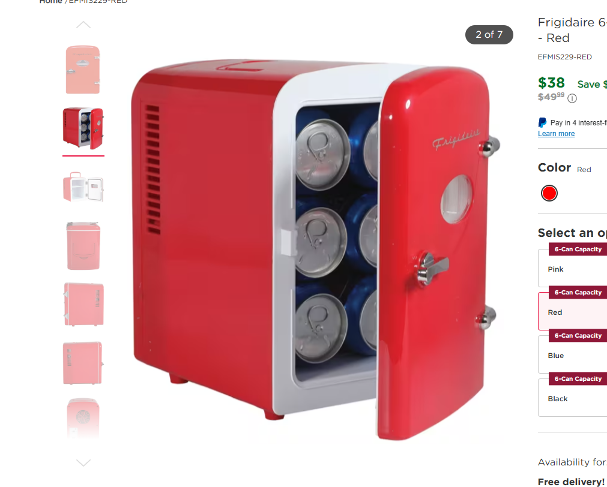

## Choosing a mini fridge as the chassis

The honest answer is that the chassis was the joke and everything else was the engineering. A Frigidaire retro mini fridge is the right size, it is thermoelectric so it runs on 12V DC instead of needing a compressor and mains power, and it has a door. That last part mattered more than I expected. A robot that drives around is a robot. A robot that drives around and opens its own door to hand you a drink is a character.

It also gave me a hard constraint that made every other decision easier. The fridge body is the chassis. Everything has to fit under it, on it, or inside it. No sprawling breadboard, no "I will find somewhere for this later."

## Build phases and gates

I have burned enough weekends on projects that collapsed under their own integration debt that I now refuse to start with the fun part. I broke this into eight phases, bottom up, with a hard gate at the end of each one. A gate is a specific observable thing that has to be true before I move on. Not "the code compiles." Something I can see.

1.  Jetson alive, ROS 2 installed, verified with a real pub/sub test

2.  ODIN 1 depth camera publishing real data, visible in rviz2

3.  Rear webcam plus a working target tracker

4.  ESP32 firmware and bench ESC test

5.  Full drive integration on the actual chassis

6.  Behavior layer: follow, flee, mode switching

7.  Nav2 obstacle avoidance

8.  Web UI and remote control

The gates are the whole point. When something breaks in phase 6, I want to be debugging phase 6, not wondering whether my problem is actually a bad assumption from phase 2. Every time I skipped ahead in this project, I paid for it.

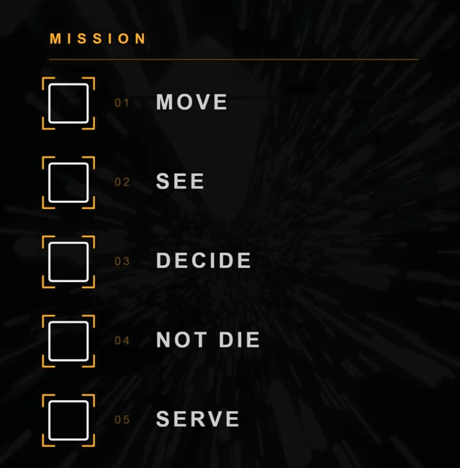

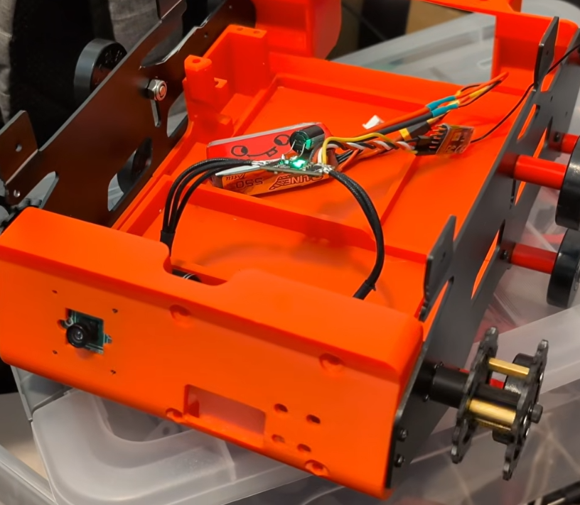

## The drive system

Two Repeat Robotics Ultra Mk2 brushless gearmotors, an AM32 dual bidirectional ESC, full length tank treads. The Ultra Mk2 is a 12lb combat robot class motor, which puts a loaded mini fridge right at the upper end of what these are rated for. That was deliberate. I wanted headroom to eventually uncap the speed, and underpowered drive is miserable to work around later.

Track width came out to 9 inches, which is 0.2286 meters. That number shows up in the differential drive math and I had a placeholder value of 0.3m in there for weeks before I measured the real chassis. Worth mentioning because a wrong track width does not break straight line driving at all. It only skews your turn rate, which means it fails silently and then confuses you later when nothing turns the way you expect.

## Power: three isolated rails

This is the part people skip and then spend three days debugging brownouts.

-   **Logic and accessories:** 2S LiPo into a boost converter, out at a stable 12V. Feeds the Jetson, the ODIN 1, and the fridge itself.

-   **Drive:** 4S LiPo pack directly into the ESC. Nothing else touches this rail.

-   **Door servo:** its own buck converter at around 6.5V.

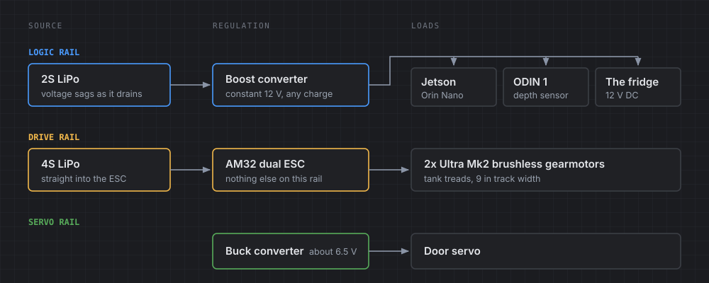

I started this design on a 3S pack for the logic rail and switched to 2S plus boost. The reason is the discharge curve. A 3S LiPo runs from 12.6V down to about 9.9V, and the Jetson Orin Nano wants 9 to 20V in. Technically that fits. In practice you get instability at the bottom of the curve, right when your battery is low and you least want a surprise reboot. Boosting up from 2S means everything downstream sees a constant 12V regardless of pack state.

Keeping drive power fully isolated from logic power is not optional with brushless motors. Those ESCs spike hard on acceleration and you do not want that noise anywhere near your compute.

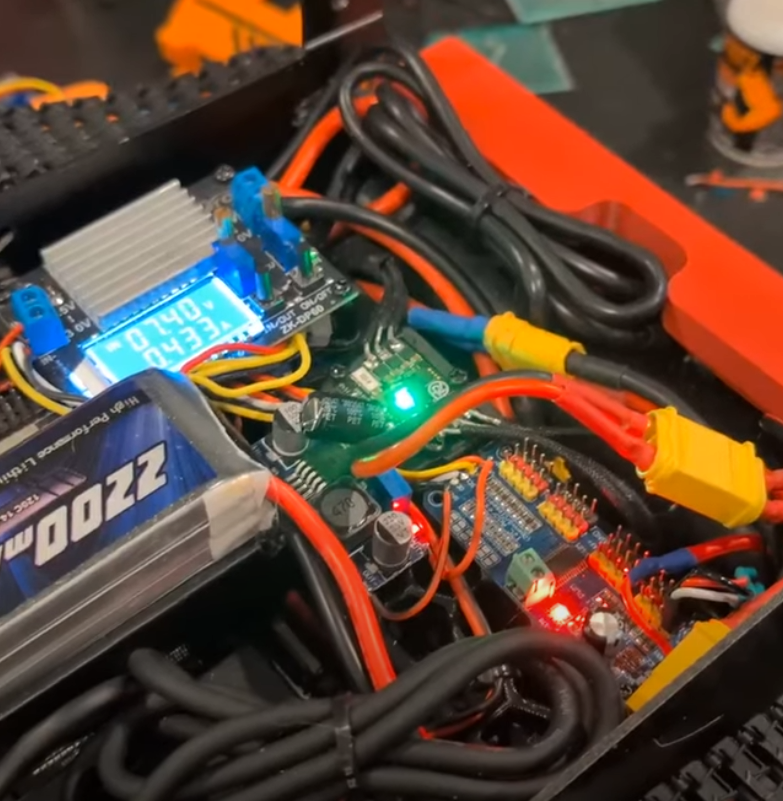

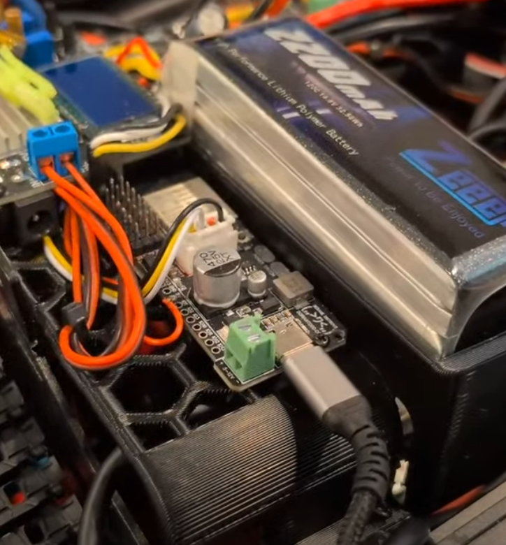

## Separate ESP32 motor controller

An obvious question came up partway through the build: the Jetson has GPIO pins. Why bother with an ESP32-S3 in the middle?

One reason, and it is the whole reason: the safety watchdog.

The ESP32 runs a hard 500ms watchdog. If it stops receiving valid command packets, it forces both motors to neutral. That happens on a dedicated microcontroller with one job, completely independent of whether Linux is healthy, whether ROS is running, or whether some node has hung.

If I drove the ESCs directly from Jetson GPIO, the failure mode is: Jetson kernel panics or a node hangs mid-flee, GPIO freezes at whatever value it last held, and a multi-kilogram robot keeps driving at speed with nothing watching. That is not a theoretical concern. That is a thing that will eventually happen to any robot you run for long enough.

There is also a real-time argument. Generating clean, jitter-free 50Hz PWM from userspace on a general purpose OS is harder and less reliable than doing it on bare metal. But the watchdog is the argument that actually settles it.

### Debugging an ESC that would not arm

The ESCs beeped their "no signal" pattern forever. The instant I powered the ESP32, the beeping stopped, which meant they were seeing *something*. But they never reached the happy arm tone.

I went deep. I checked whether the AM32 config had the wrong input protocol set. I checked whether it needed a specific arming signal sequence. I pulled up an old balancing robot project of mine that used the same ESCs and diffed the setup code line by line. I rewrote the PWM generation twice.

It was a cold solder joint.

I am including this because it is the most honest thing in this whole article. I spent an afternoon chasing timing races and protocol detection edge cases, and the actual answer was that a joint was not making contact. Check your hardware first. I know. I know.

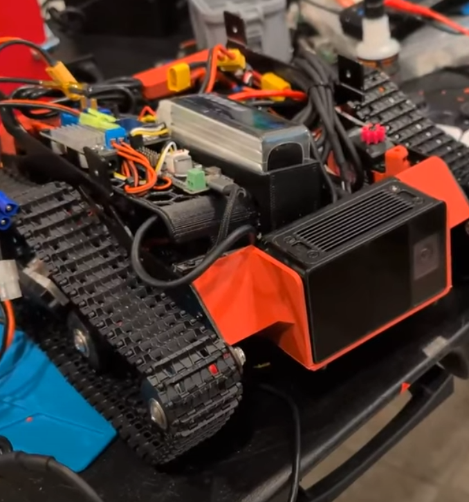

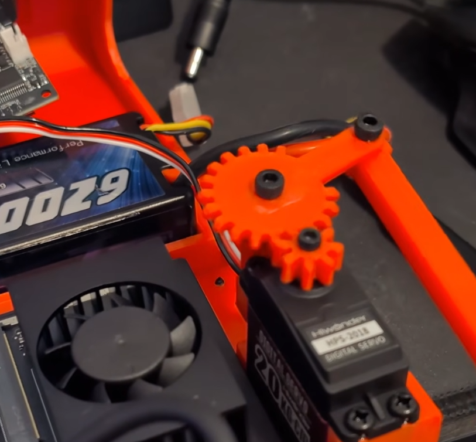

### Door servo failing from ESP32 PWM timer limits

Once motors worked, I added the door servo on a direct GPIO pin. It did nothing.

The cause turned out to be that `ESP32Servo` hit an internal PWM timer allocation limit trying to manage three simultaneous channels. Two motors plus one door servo was one too many. The tell is that `attach()` returns a negative value when it fails, which is easy to never check because most example code ignores the return value entirely.

The fix was moving the door servo onto a PCA9685 breakout over I2C. That board has its own dedicated PWM chip and handles servo timing independently, which sidesteps ESP32 timer allocation completely. When the antenna servos get added later, they go on the same board.

## The command protocol

The Jetson talks to the ESP32 over USB serial with a 4 byte packet:

```text
[0xFF] [LEFT] [RIGHT] [DOOR]
```

`0xFF` is a sync byte that always leads. Left and right are unsigned bytes from 0 to 200, where 100 is stop, 0 is full reverse, 200 is full forward. Door is 0 for close, 1 for open, 2 for no change.

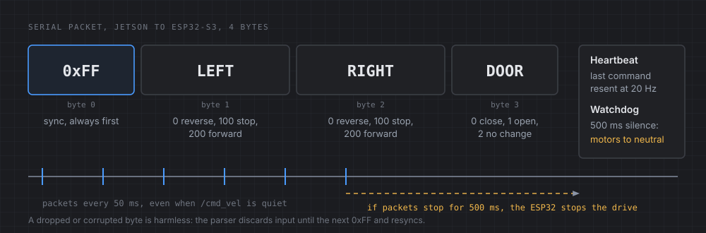

Two design decisions in there that I would repeat:

**The sync byte makes the parser self-healing.** If a byte gets dropped or corrupted, the state machine discards everything until it sees `0xFF` again and resyncs on the next packet. No manual error recovery needed.

**Packets are sent on a fixed 20Hz timer, decoupled from when `/cmd_vel` messages actually arrive.** This one is not obvious and it matters. If the ESP32 only heard from the Jetson when a new velocity command was published, and the upstream publisher went quiet for half a second (which is completely normal, plenty of ROS publishers only publish on change), the safety watchdog would fire during normal operation. Caching the last command and heartbeating it at a fixed rate fixes that.

I also kept a text command protocol alongside the binary one for bench debugging. You can type `L50 R-30` into a serial monitor and drive the motors directly, or `TL-2` to trim one side, or `DB5` to adjust the deadband. The parser checks for `0xFF` first and falls through to text parsing otherwise, so both coexist on the same port with no ambiguity. This paid for itself many times over.

## Jetson setup on JetPack 7.2 and ROS 2 Jazzy

Jetson Orin Nano Super, running JetPack 7.2 on Ubuntu 24.04.

That last detail caused problems immediately. Almost every ROS 2 robotics tutorial on the internet assumes Ubuntu 22.04 and ROS 2 Humble. Ubuntu 24.04 means ROS 2 Jazzy, and Jazzy is new enough that a lot of vendor documentation has not caught up.

Concretely: the ODIN 1 driver from Manifold Tech officially documents Foxy and Humble only. Jazzy is not on the list. It turned out to build and run fine with zero source changes, but I did not know that going in, and the entire first bring-up attempt was spent not knowing whether my problems were Jazzy incompatibility or something else.

If you are on a recent JetPack, expect this. Your OpenCV will be a different version than the tutorials assume, your ROS distro will be one nobody has written about yet, and half your debugging will be establishing which of your assumptions are actually true.

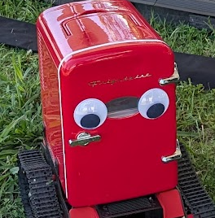

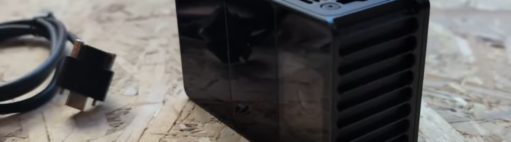

## ODIN 1 driver blocked by a firmware version check

The ODIN 1 from Manifold Tech is the front sensor. SPAD dToF depth, RGB camera, IMU, and onboard SLAM that runs on the module itself rather than eating my Jetson's CPU. It connects over USB-C, which was itself a correction: I had built my whole mounting plan around Ethernet based on older documentation before checking the actual hardware in front of me.

> [!SPONSOR] manifold
> The ODIN 1 spatial memory module from Manifold Tech is the fridge tank's forward sense of the world: SPAD dToF depth, an RGB camera, an IMU and onboard SLAM in one USB-C module, so mapping doesn't eat the Jetson's CPU. When I hit the firmware gate below, Manifold's team sent the update package and worked out the two-step upgrade path with me.
>
> 

Then the driver refused to talk to it:

```text
[ERROR] [lidar_device_callback]: The soc version is too low,
please upgrade the device firmware to at least 0.12.0
```

My unit shipped with SoC firmware 0.8.1. The driver hardcoded a minimum of 0.12.0.

Worse, the driver did not fail gracefully. It logged the error and then segfaulted, taking rviz2 down with it via a `system("pkill -f rviz")` call in the shutdown path. The first time it happened it looked catastrophic. It was actually just a version check.

I dug into the driver source to understand what specifically required 0.12.0. The threshold is a bare `#define` in `host_sdk_sample.cpp`, and git history showed the commit that introduced it, tagged 0.12.0 release, with a changelog entry about reduced cloud SLAM latency and improved mapping result retrieval. That same commit also retargeted the driver's USB product ID to match my exact unit.

Then I checked whether 0.12.0 firmware actually existed anywhere I could reach. It did not. Not in the driver repo's full git history, not on the public wiki (which topped out at 0.11.3), nowhere.

So I contacted Manifold. They sent me the package. It failed partway through, on a file called `db.bin`:

```text
transfering extra file db.bin
[ERROR][protocol.cpp:send_file_handler:1050]: file start fail.
transfer extra file db.bin fail. please retry.
current progress was not commited on device, no change made.
```

I stopped there rather than retrying, because their own documentation says to contact support on that specific error rather than retry blindly. Retrying a firmware flash on a device in an unknown state is how you turn a recoverable problem into a brick.

Digging into the package contents showed that `db.bin` and `feat.yml` had different timestamps and permissions than the core firmware blobs, which suggested they were new file types added specifically for this release. My guess was that firmware 0.8.1 simply had no code path for receiving them.

That turned out to be right. Manifold's fix was a two step update: 0.8.1 to 0.11.3 first, then 0.11.3 to 0.12.0. The intermediate version teaches the device how to accept the new file types. It worked on the first try.

**Lesson I am taking forward:** when a vendor tool tells you not to retry, do not retry. And when you are debugging closed source firmware, the open source driver that talks to it is often where the answers actually live.

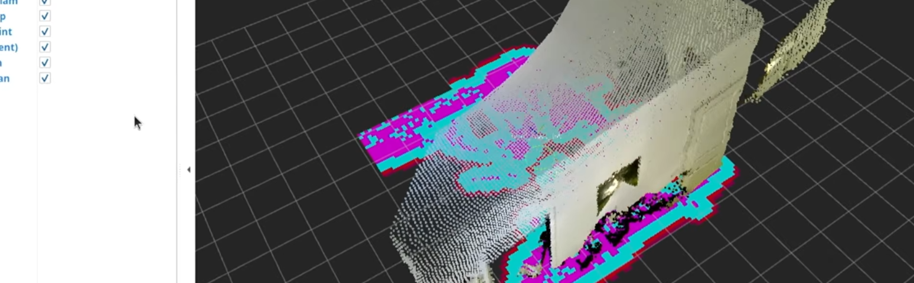

## Point cloud not showing in rviz2 (camera pointed at empty space)

Once the driver worked, the point cloud would not render in rviz2. Odometry showed up. The camera image showed up. The point cloud, nothing.

I checked the frame IDs. They matched. I checked QoS settings on both publisher and subscriber. They matched. I checked that the display was enabled. It was. I confirmed real data was flowing at 7Hz with 35,000 valid points per message and zero NaNs.

The rviz2 camera was pointed at empty space. The SLAM origin had drifted about 18 meters from where the saved camera view was looking, so the points were rendering correctly the entire time, just outside the viewing frustum.

Now, whenever a topic looks healthy but nothing appears on screen, checking where the camera is actually pointed is the first thing I do rather than the last.

## Perception: markers, then people

I started with ArUco markers because they are precise, well tested, and give you a real pose rather than a bounding box. Detection worked well, bearing and distance were accurate, and I got it running quickly.

Then I tried to test obstacle avoidance and hit the contradiction. Nav2 needs an obstacle between the robot and the target to demonstrate that it routes around it. ArUco needs unobstructed line of sight to that same target. The system loses its goal at exactly the moment it is supposed to prove itself.

Also, practically: holding a printed marker while filming is not a good look.

So I swapped to YOLO11n person detection, exported to TensorRT FP16. The swap itself was clean because I made the new nodes publish to the exact same topic names and types the ArUco nodes used. Everything downstream (target selection, PID, goal generation) needed zero changes. That is worth designing for deliberately: put a stable interface between your sensing layer and everything else, and swapping sensors becomes an afternoon instead of a rewrite.

One asymmetry worth flagging. The front camera is the ODIN, so I get real depth: take the bounding box center pixel, look up actual distance from the point cloud. The rear camera is a plain webcam with no depth sensor, so rear distance is estimated from bounding box height. That is meaningfully less precise, and flee mode depends on the rear camera. It is a known limitation rather than a solved problem.

YOLO also tolerates partial occlusion much better than ArUco, since it recognizes a whole human silhouette rather than a small precise pattern. It does not solve full occlusion. If you step entirely behind a couch, both approaches fail identically.

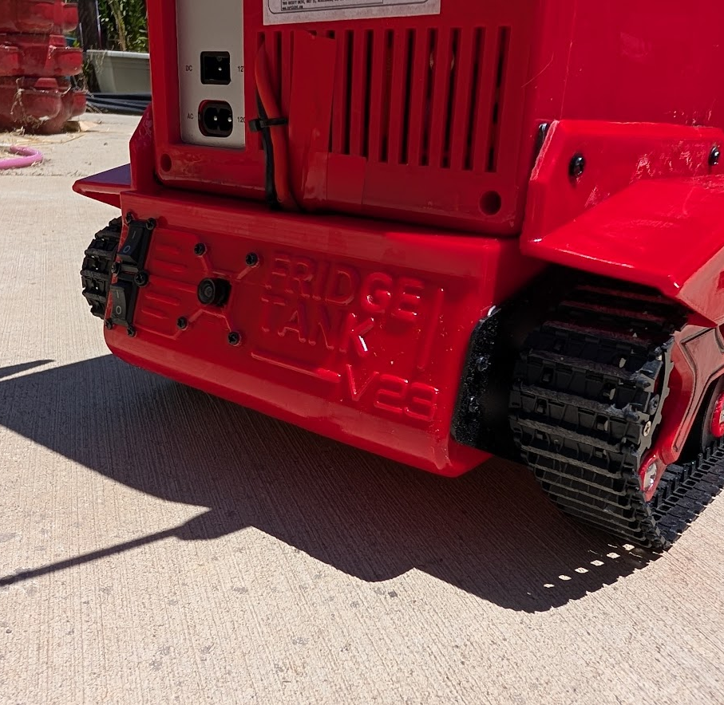

## The behavior layer

The mode model is two independent dimensions:

**Drive source:** manual, semi, or auto. Manual means the controller drives entirely. Auto means the robot drives entirely. Semi blends them, so autonomous tracking runs and produces a base command while my stick input gets added on top as a bias. Assisted teleoperation, essentially.

**Track mode:** follow or flee. Follow uses the front ODIN camera and chases. Flee uses the rear camera and runs.

Around that sit a handful of nodes: a target selector that unifies both trackers into one set of topics so downstream code never needs to know which camera is active, a PID controller, a drive mux that arbitrates between command sources, and a safety watchdog at the ROS level (separate from and in addition to the ESP32's hardware watchdog).

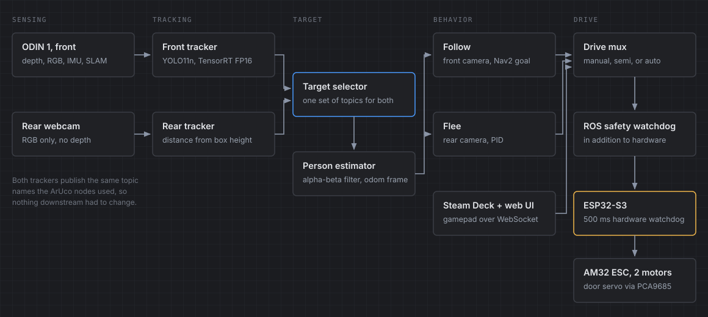

### QoS mismatch on mode topics

Mode state topics are published with `transient_local` QoS so that late joining nodes inherit the current mode. But at least one consumer was subscribing with `volatile`.

The effect: any node that restarted would silently run with its default mode until the next explicit mode command arrived. I caught it when a restarted `target_pid` node was stuck in follow behavior during an active flee test.

Think about that failure mode for a second. The robot is supposed to be running away from someone. A node restarts. It comes back thinking it should be driving toward them.

It was fixed by applying a shared latched QoS profile across every consumer. But it is a good example of the kind of bug that passes every test except the one that matters.

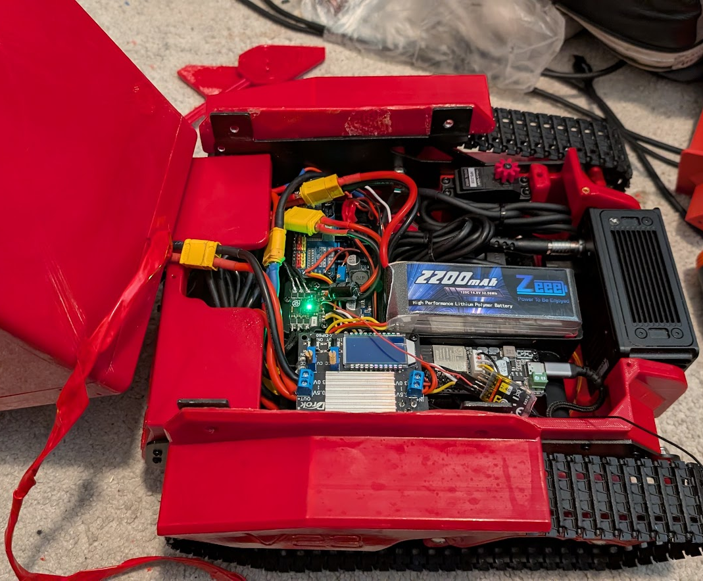

## Debugging a follow goal that moved with the robot

Once everything worked technically, it did not work well. Follow mode would set a goal, start driving, and then along the way it would lose track of me and give up. Sometimes it would spin in slow circles. Flee mode was worse: some reasonable initial movement, then random turning, then wide arcs that put me out of frame entirely, ending with the robot stopped and facing me. Not ideal for something supposedly running away.

My first instinct was that everything was too slow. Which was partly true, but not the main thing.

The actual problem was that the goal position was computed roughly like this:

> YOLO gives bearing and distance relative to the robot, transform that into the odom frame using the robot's current pose, set that as the Nav2 goal.

Every term on the right hand side depends on the robot's own pose estimate. So any odometry drift, any timestamp mismatch between when an image was captured and when the transform lookup happened, any small motor asymmetry, all of it gets injected directly into where the system believes *I* am standing.

Robot turns slightly. New bearing. Goal moves. Nav2 replans. Robot turns more. That is the circling.

The fix had three parts:

1.  **Track the person in a world fixed frame with a motion model.** An alpha-beta filter holding position and velocity in the odom frame. A new detection *corrects* that estimate rather than replacing it. If the robot moves and I did not, the world frame estimate stays put.

2.  **Timestamp discipline.** Look up the transform at the image's capture timestamp, not at processing time. At 2.5 m/s with 150ms of pipeline latency, the robot has moved 40cm. Fusing a detection against a pose from 40cm ago is a real error, not a rounding detail. It is also invisible when you test slowly on blocks and vicious at speed.

3.  **Persistence through dropout.** Losing detection for 300ms should not mean giving up. The filter coasts on its velocity estimate with decaying confidence, full behavior for about half a second, degraded after that, and only then does it actually consider the target lost.

There is a wrinkle here worth mentioning. The ODIN's point cloud clock is offset from ROS time by tens of minutes. So `now() - header.stamp` produces nonsense. The estimator uses `header.stamp` only for the transform lookup itself, which is self consistent regardless of clock domain, and uses monotonic local time for all age and confidence bookkeeping.

I also built a persistence and recovery state machine on top: tracking, coasting, searching, recovering, lost. With one deliberate asymmetry between modes. In follow mode, losing the target means stop, rotate toward last known bearing, and scan. In flee mode, losing the target means keep going on the last heading while scanning, because if you are running from someone and briefly lose sight of them, you do not stop and turn around to look. That was exactly the observed bug.

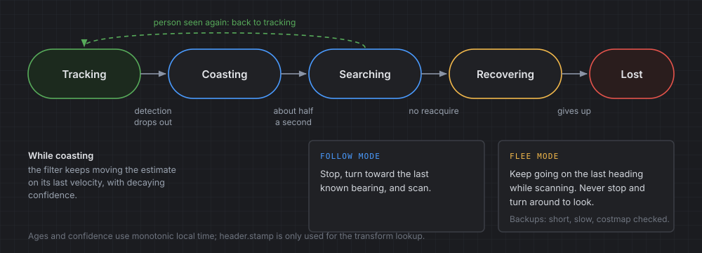

Recovery from being stuck has a real constraint: the ODIN faces forward and the rear camera has no depth. Backing up is semi-blind. The saving grace is that the rolling local costmap retains recently observed obstacles even after they leave the field of view, so a backup maneuver can be checked against the map. Backups are short, slow, and costmap verified.

## Debugging perception running at 2.3 Hz

The perception pipeline was publishing detections at 2.3Hz. The target was 30.

At that rate, during a search sweep, the robot rotates in coarse angular chunks large enough to miss a person entirely between frames. It was not bad luck. Missing me was the expected outcome given the sampling rate.

I assumed the model was falling back to CPU. `tegrastats` seemed to confirm it: `GR3D_FREQ` 0% on every single sample, while all six CPU cores sat between 59 and 99 percent. The TensorRT engine file existed on disk. My conclusion was that it was not being loaded and something was silently running PyTorch on CPU instead.

I was wrong, and the real answer is better.

The engine path was correct. TensorRT version matched CUDA exactly. Device arguments were right. Profiling the live process with `py-spy` showed where the time was actually going: a point cloud callback doing a pure Python per-point list comprehension over up to 49,152 points, arriving at 5Hz, costing 50 to 150ms every single time.

`rclpy` uses a single threaded executor by default. That CPU-bound callback was blocking the image callback (the one that actually invokes TensorRT) from running at all. The GPU was not falling back. It was being starved.

Vectorizing that loop with numpy took it from 2.3Hz to about 10.5Hz and got GPU utilization off the floor. Gating debug image encoding on whether anything is actually subscribed, plus fixing the rear camera, took the rear tracker from 3.5Hz to 27Hz.

The front tracker is still at 10.5Hz against a 30Hz target. That remaining gap is per frame CPU preprocessing plus general system contention across all six cores, with two YOLO engines and the full Nav2 stack running concurrently. It is a real architectural problem rather than a config fix, and it is still open.

Three things I took from this:

1.  `tegrastats` showing an idle GPU does not mean your model is on CPU. It might mean nothing is calling it.

2.  Profile before you optimize. My hypothesis was reasonable, well supported by the evidence I had, and completely wrong.

3.  One slow callback in a single threaded executor starves everything else in that node. That is a whole class of bug worth watching for.

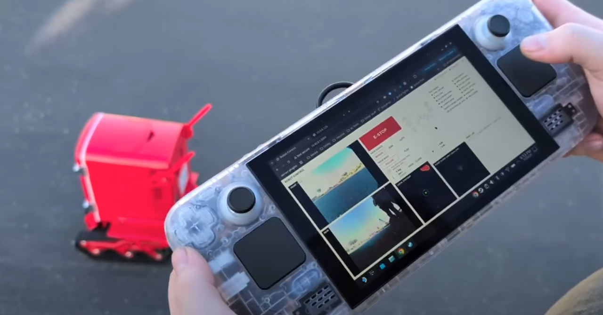

## Manual control with a Steam Deck

The control interface is a web page served from the Jetson, designed to fill a 1080x720 screen with no scrolling. Live feeds from both cameras with YOLO bounding boxes and the PID deadzone drawn as overlays, a full ROS node status grid, an event log, mode buttons, door status, and a large e-stop.

The Steam Deck opens that page in its browser and reads its own sticks and buttons through the HTML5 Gamepad API, which streams over WebSocket to the Jetson and gets republished as ROS topics.

I went this route rather than pairing the Deck over Bluetooth because the Deck is designed to be a host, not a peripheral. Trying to make it act like a Bluetooth gamepad means fighting the hardware's intent. Routing through the browser reuses infrastructure the web UI needs anyway.

Since I film in places without WiFi, the Jetson broadcasts its own network with NetworkManager. The Deck connects to that. The whole system is self contained, no infrastructure required.

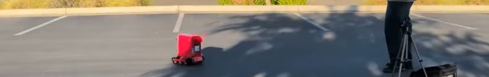

## Known issues

I would rather list these than pretend the project is finished.

-   **Full occlusion still kills tracking.** YOLO tolerates partial occlusion. It does not see through furniture. The right fix is ultra wideband positioning, a tag I carry and an anchor on the robot, using radio time of flight instead of line of sight. That works through walls and bodies and gives both range and bearing, which drops straight into the existing goal bridge. It is a hardware sub-project I have not started.

-   **Rear distance is a heuristic.** No depth sensor on the rear camera means flee mode's distance estimate comes from bounding box height. It works. It is not precise.

-   **No target re-identification.** Target selection is "largest bounding box, every frame." With multiple people in view it will relock onto whoever is closest, not necessarily the same person as a moment ago.

-   **Front tracker is at 10.5Hz, not 30.** Fine at low speed. As I uncap the speed limit, perception rate stops being a nicety and becomes a safety property. At 2.5 m/s, 10Hz means 25cm of travel between detections.

-   **Flee mode still needs work.** The plan is making Nav2 conditional rather than always-on. Baseline flee should be direct servoing (PID on rear bearing, drive forward) with Nav2 engaging only when an obstacle actually blocks the escape heading, then handing back once clear. Handing a "run away from that person" problem to a goal-based path planner was asking the wrong tool to solve it, and the wide arcs were the symptom.

### Lessons learned

**Bottom up, with real gates.** Every time I jumped ahead I paid for it in debugging time. The gate at the end of each phase has to be something observable, not "it compiles."

**Check the hardware first.** Cold solder joint. Afternoon lost. I will probably do it again anyway.

**Profile before optimizing.** My 2.3Hz hypothesis was reasonable and wrong. `py-spy` answered in minutes what I had been guessing at for an hour.

**Slow is a symptom, not always a diagnosis.** Most of the weird behavior was architectural. If I had only made the existing architecture faster, I would have gotten faster wrong behavior.

**Keep interfaces stable across layers.** Making YOLO publish to the same topics ArUco used meant swapping the entire perception layer touched nothing downstream.

**Write down why, not what.** Comments explaining that the ODIN clock is offset, or why the door servo is on an I2C board instead of a GPIO pin, or why a value is 0.2286 and not 0.3, are the ones that stop me from re-breaking things in three months.

## Watch the video

Final results and demos are in the full video.

https://www.youtube.com/watch?v=_FpqlkK-Nx8

The fridge also made a few appearances in William Osman's video:

https://www.youtube.com/watch?v=5Y21THNFZWg

