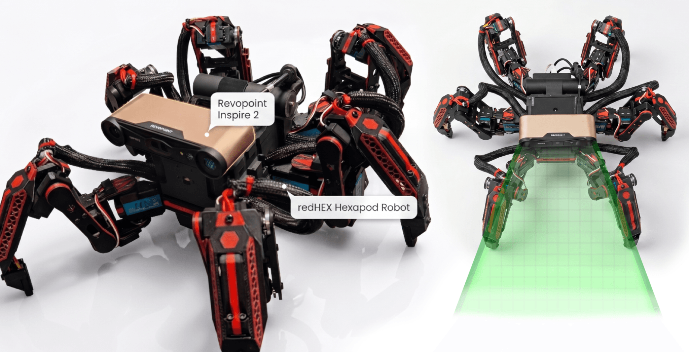
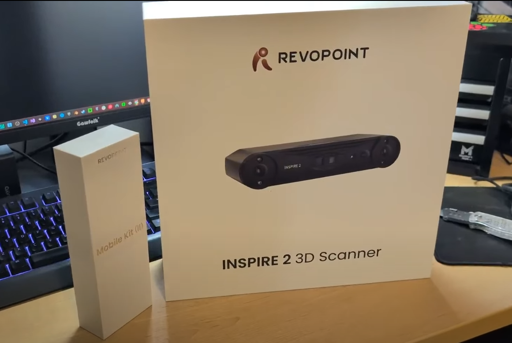
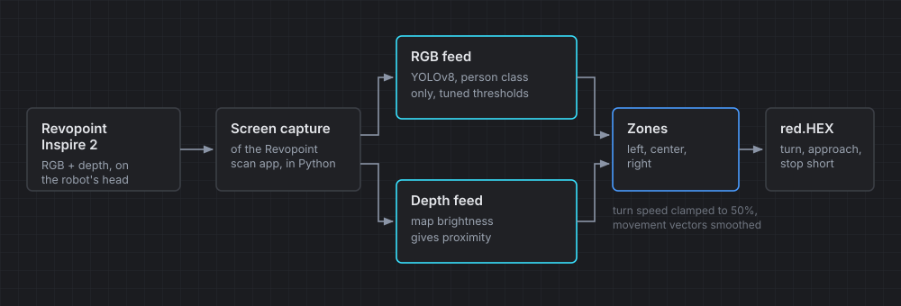
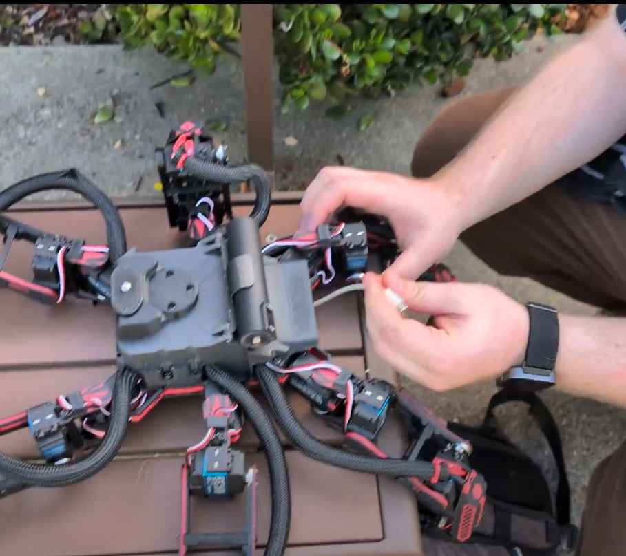

## Overview

For two years, my hexapod robot, Red Hex, was essentially a high-tech paperweight. Based on the Chica Hexopod open-source project, it’s a beast of a machine: six legs, 18 high-torque motors, and a complex gait system. But despite its mechanical prowess, it was "dumb." It could move, but it couldn't see.

The goal of Project Hex-Vision was to transform this dormant machine into an autonomous predator capable of identifying, tracking, and chasing humans. This was achieved through a unique integration of 3D scanning technology and machine learning.

## Hardware: a new set of eyes

The catalyst for this project was the Revopoint Inspire 2. While traditionally marketed as a high-precision 3D scanner for engineering, I saw a different utility for it. It is a lightweight, dual-feed sensor capable of providing both RGB and Depth data.

To integrate the scanner, I had to overhaul the physical structure of the robot. After years of wear, several components had developed fatigue. I 3D-printed reinforced replacement parts and designed a custom 1/4-20 mounting system to secure the scanner to the head of the hexapod. This gave the robot a stabilized, high-resolution vantage point.

## Software architecture

The core challenge of this project was not just detection. It was control. I needed a way to bridge the gap between high-level AI vision and the low-level motor kinematics that keep a hexapod balanced.

### The vision pipeline

The software stack is built in Python, using OpenCV and the YOLOv8 model. Instead of tapping into the hardware at a driver level, I used a high-speed screen-capture method. The program monitors the Revopoint scan app output in real time.

### Spatial intelligence

The program divides the visual field into three distinct zones: Left, Center, and Right.

-   **RGB Feed:** YOLOv8 identifies the "person" class within these zones.

-   **Depth Feed:** The system analyzes the brightness of the depth map to calculate proximity.

By combining these, the robot knows exactly where a person is in 3D space relative to its own chassis.

## Engineering challenges and iteration

The transition from theory to autonomy was fraught with traditional robotics hurdles.

-   **The Overcorrection Problem:** In early tests, the robot suffered from massive "hunting." It would turn toward a person, overshoot due to momentum, and lose the target. I solved this by clamping the maximum turn speed to 50 percent and implementing a smoothing filter on the movement vectors to dampen sudden spikes in data.

-   **False Positives:** Early versions of the model were prone to identifying inanimate objects like refrigerators as human threats. I refined the confidence thresholds and restricted the YOLO model to prioritize person detections only.

-   **Mechanical Resilience:** To test the limits of the chassis, I took Red Hex to a skating rink for a side project called Robots on Ice. The experiment proved that the six-legged design is inherently superior for low-friction environments. It maintained balance where bipeds would have failed.

## Results: autonomous engagement

After weeks of debugging the feedback loops and optimizing the Python engine, the result was a robot that felt truly alive. In the final field tests, Red Hex demonstrated the ability to scan and acquire a target, maintain its stance in real-time, and close the distance while stopping at a predetermined safety threshold.

Project Hex-Vision serves as a case study in hacking existing hardware to achieve advanced autonomy. By combining consumer 3D scanning tech with modern AI models, we can turn static machines into reactive, intelligent agents.

## Watch the video

See it in action, along with the engineering process, in the full video.

https://www.youtube.com/watch?v=2j9Mnt1yF1U

## Resources

-   **Base robot:** [Chica hexapod](https://www.makeyourpet.com/) by Make Your Pet
-   **Scanner:** Revopoint Inspire 2
