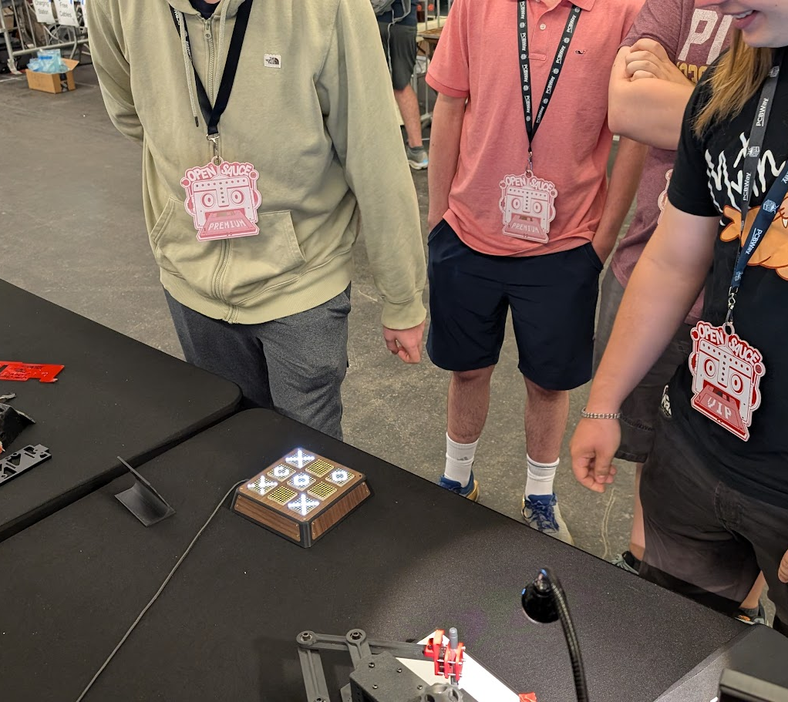
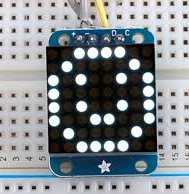
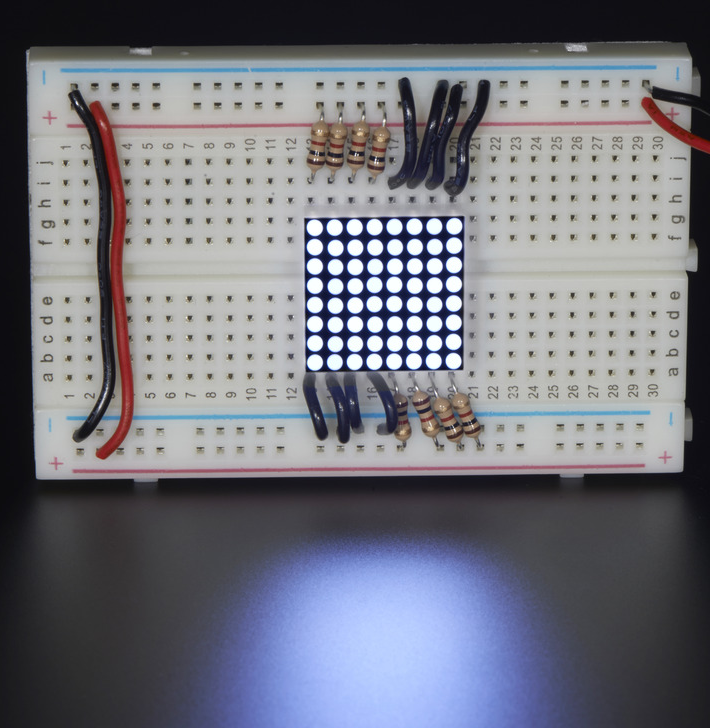
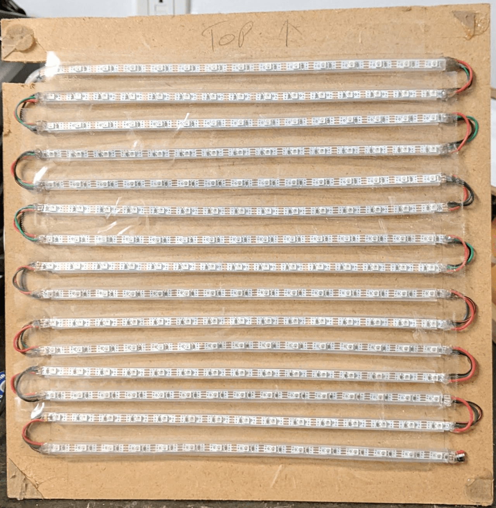
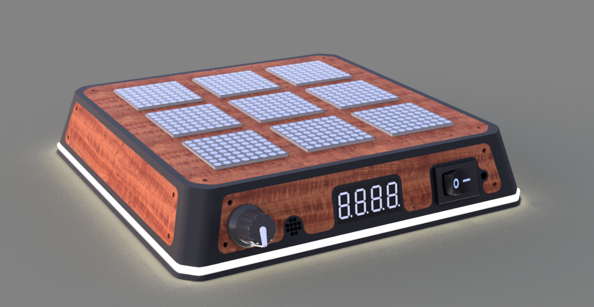
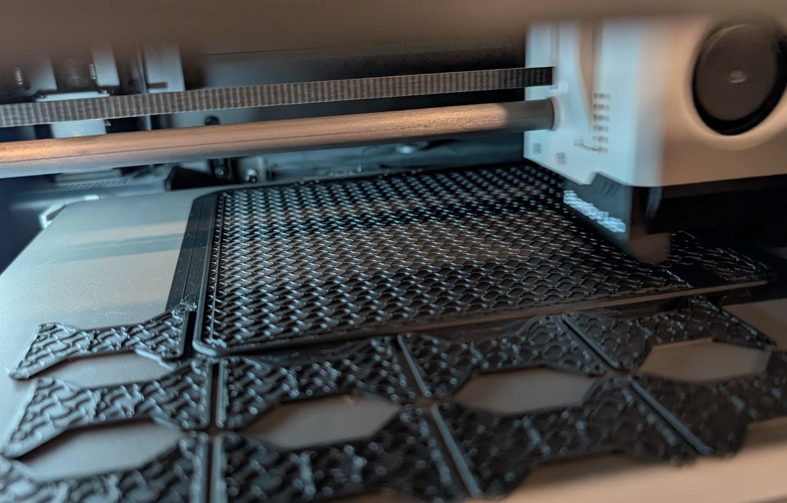
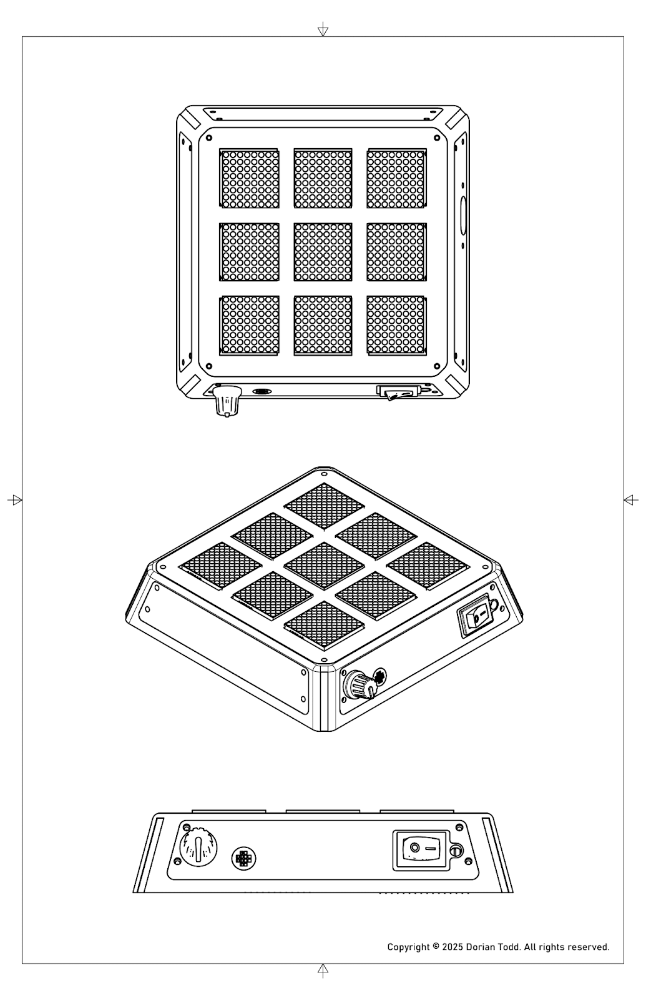
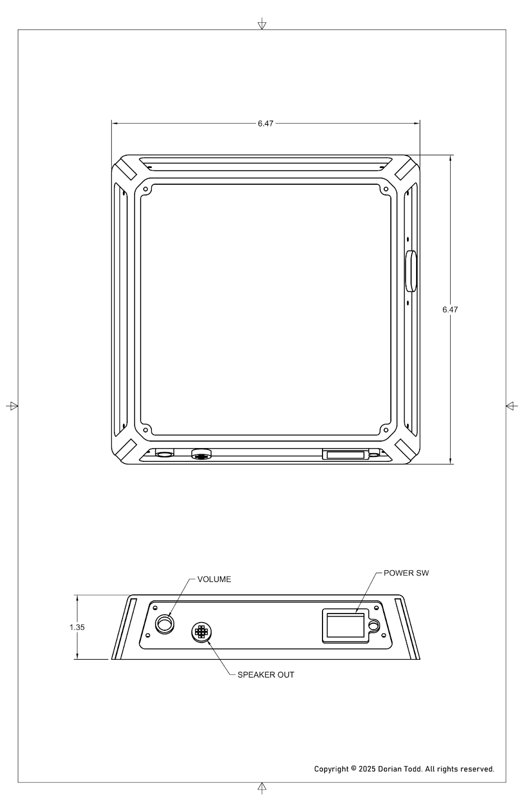
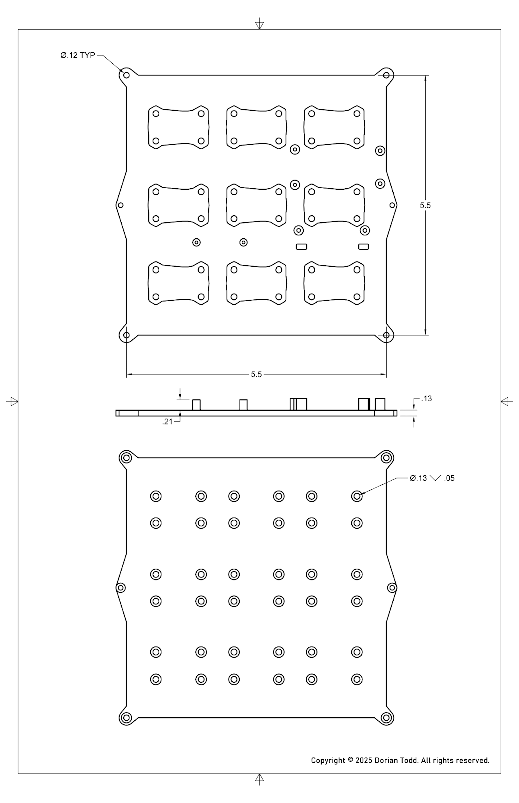
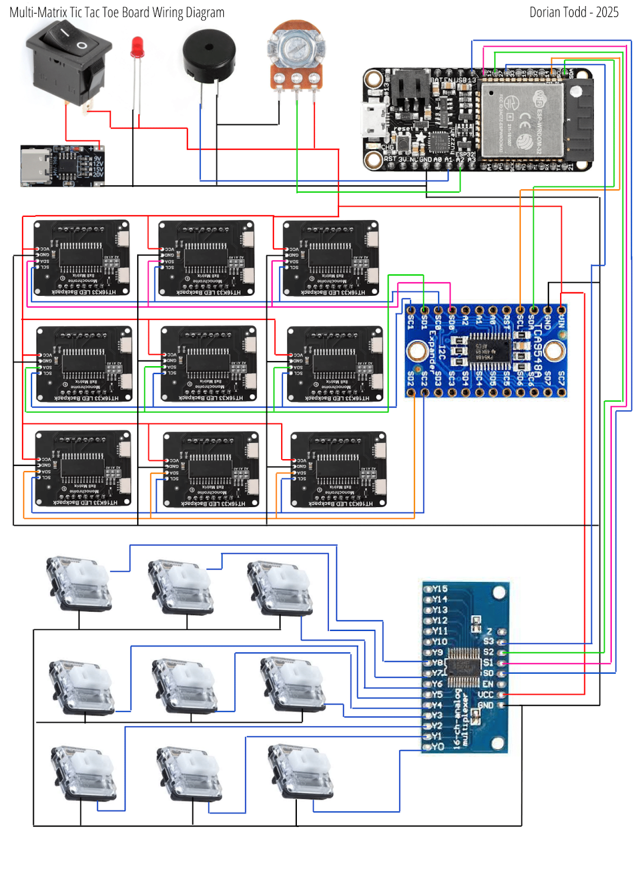

## Overview

The Matrix Game Board is an engineering project focused on designing and building an interactive and tactile Tic-Tac-Toe game. The project's innovation lies in using nine separate 8x8 LED matrix displays to serve as both the visual game board and the player input mechanism.

Developed as a technical challenge, this project documents the entire engineering process, from initial research and CAD design through manufacturing, complex wiring, assembly, and testing. It highlights a unique approach of using the LED matrices themselves as pressure-sensitive buttons, activated by underlying mechanical switches, all housed within a compact and portable form factor.

## Key features

-   Interactive LED Display: Utilizes nine 8x8 LED matrix modules (HT16K33) to display the Tic-Tac-Toe game state, animations, and player symbols.

-   Integrated Input: Each matrix display doubles as a pressure-sensitive button, using a low-profile mechanical keyboard switch mounted underneath for a unique and satisfying interaction.

-   Tactile & Audio Feedback: Mechanical switches provide a satisfying tactile click, while an integrated Piezo buzzer with volume control provides audio feedback for game events.

-   Compact Design: The entire assembly is designed to fit within a 6.5-inch cubed area, adhering to the original competition constraints.

-   Custom Enclosure: Features a 3D-printed base with integrated component mounts for clean assembly and a laser-cut wood top panel for a refined aesthetic.

-   Advanced Electronics: Incorporates an Adafruit Feather ESP32 V2 microcontroller, I2C multiplexing for the displays, and analog multiplexing for the switches to efficiently manage all components.

-   Battery Powered: Designed with support for a Lithium Polymer battery, making the device fully portable.

### Design and manufacturing

When the SVMA Tic Tac Toe board design competition was announced, I immediately envisioned creating an interactive LED matrix display board that would represent game symbols digitally. Having previously built a 15x15 pixel LED matrix for another project, I was familiar with the fundamentals but wanted to explore new driving techniques and display configurations for this portable gaming device that needed to fit within a 6.5 cubic inch area. Inspired by Adam Savage's "One Day Builds" methodology, I aimed to condense the timeline and complete this project in under a month.

I decided on small, lightweight white LED matrix boards from AliExpress that came with built-in matrix display driver chips, making it much easier to control nine displays with a microcontroller. For the brain of the operation, I chose an Adafruit Feather ESP32 for its battery input port, decent performance, and small form factor. Since I needed at least 18 digital output pins and 18 digital input pins, I incorporated multiplexing boards to handle all the inputs and outputs efficiently.

The CAD design phase in Fusion360 focused heavily on creating a premium tactile experience for the button actuation. I initially considered cheap micro buttons but settled on low-profile mechanical keyboard switches for better tactile feedback. Each "Matrix Cell" was designed to snap into a locking mount 3D printed into the base, with matrix cells positioned exactly 1.6 inches apart to allow for wire routing while keeping the entire board under 6.5 inches squared. The design featured laser-cut wood veneer sides for a rustic contrast to the industrial tech aesthetic, along with a front panel containing a power switch, four-digit 7-segment display, piezo speaker, and volume control.

Manufacturing began with 3D printing the prototype in PLA filament on a Bambu Lab P1S printer, which took about 5 hours and came out better than expected. The electronics proved more complex than initially anticipated, requiring two different multiplexer boards: a TCA9548A I2C multiplexer for the matrix driver boards and a CD74HC4067 analog multiplexer for handling signals from all nine switches. The displays were wired in series utilizing I2C memory addresses to drive signals individually, while shared VCC and GND connections simplified the power distribution.

The assembly process was challenging due to the intricate wiring and tight space constraints. Many connections were fragile and would break during movement, requiring careful resoldering and wire management. I discovered that the display modules were initially placed too close together, causing multiple displays to activate when pressing one, so I moved each display 0.05 inches away from center to create proper clearance. After extensive testing and debugging, I was finally able to work on the game logic for the actual tic-tac-toe functionality, which proved straightforward with the help of AI coding assistants for debugging and optimization.

## Final project

The project ultimately won **first place, Best in Show** at the SVMA event, and I felt incredibly proud to have created something that everyone seemed to think was genuinely impressive. That recognition gave me a huge boost of motivation, inspiring me to keep pushing the limits of what the board could do. After the event, I dove back into development, writing entirely new software so I could showcase an improved version at Open Sauce 2025. Over the next few weeks, I designed and programmed five brand-new game modes, experimenting with different mechanics to make the experience more engaging. One of my favorite additions was a twist on tic-tac-toe where players could only place three X’s or three O’s at a time — a simple rule change that led to surprisingly strategic and entertaining matches.

After Open Sauce 2025, the project was recognized again, this time being highlighted as one of the top ten best booths at the event for its creative and innovative approach. Seeing it receive that kind of attention from a broader audience was incredibly rewarding — it validated all the late nights spent designing, coding, and testing. More importantly, it helped me step back and see the project from a new perspective: beyond being a fun build, it actually showcased some solid engineering and effective technology. That realization encouraged me to keep refining it and to start thinking about how its concepts could grow into even more ambitious ideas.

## Coverage and documentation

Hackster.io included the board in [The Best of Open Sauce 2025: Our Top 9 Picks](https://www.hackster.io/news/the-best-of-open-sauce-2025-our-top-9-picks-0d1e72723245).

There is also [detailed project documentation](https://docs.google.com/document/d/1Iou0bSaU1I2zKiboLKdsBulBcHZG9Ty9QONq5J3xViQ/edit?usp=sharing) if you want to learn more.
