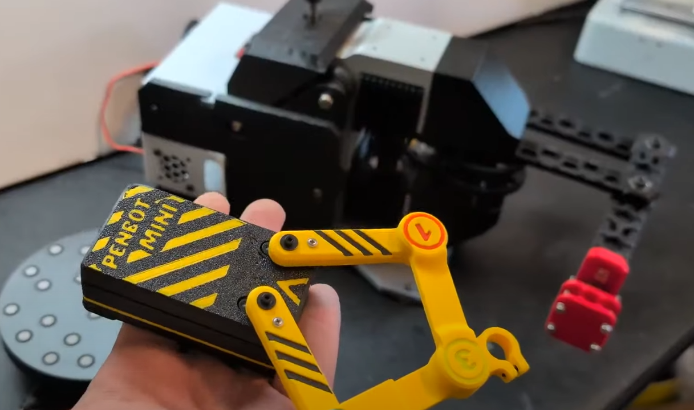
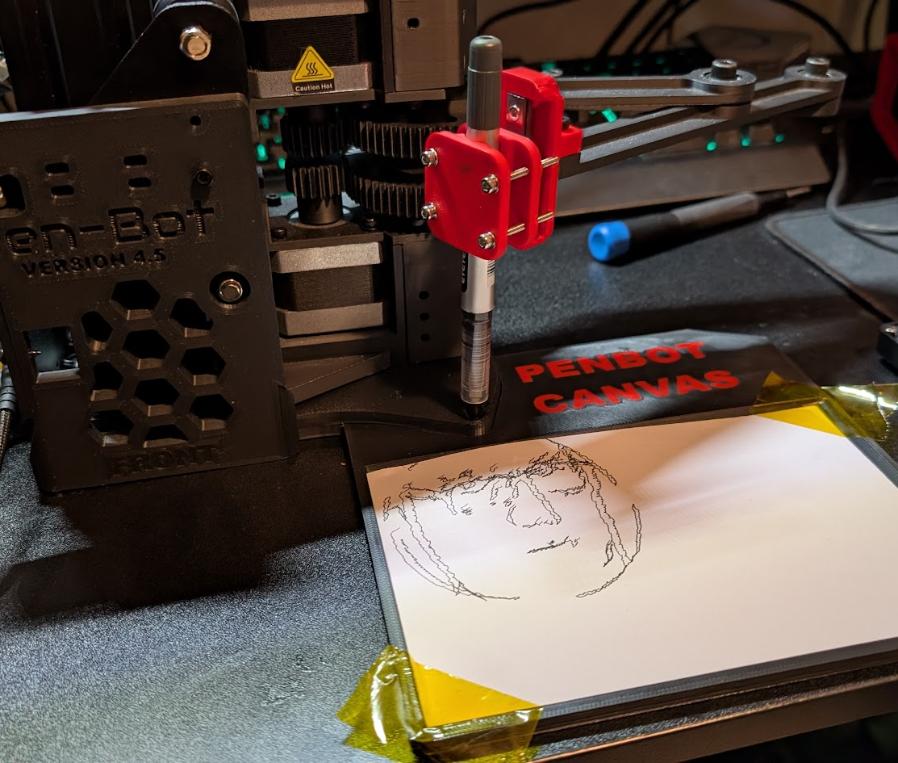
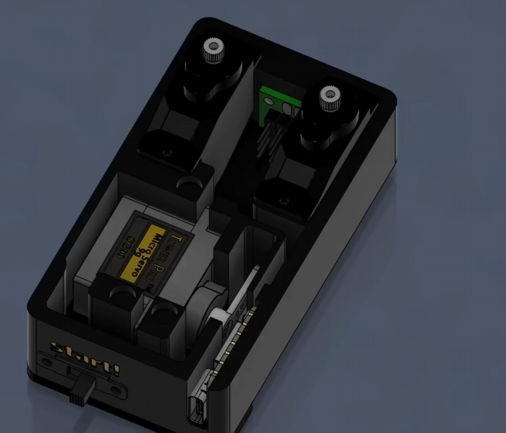
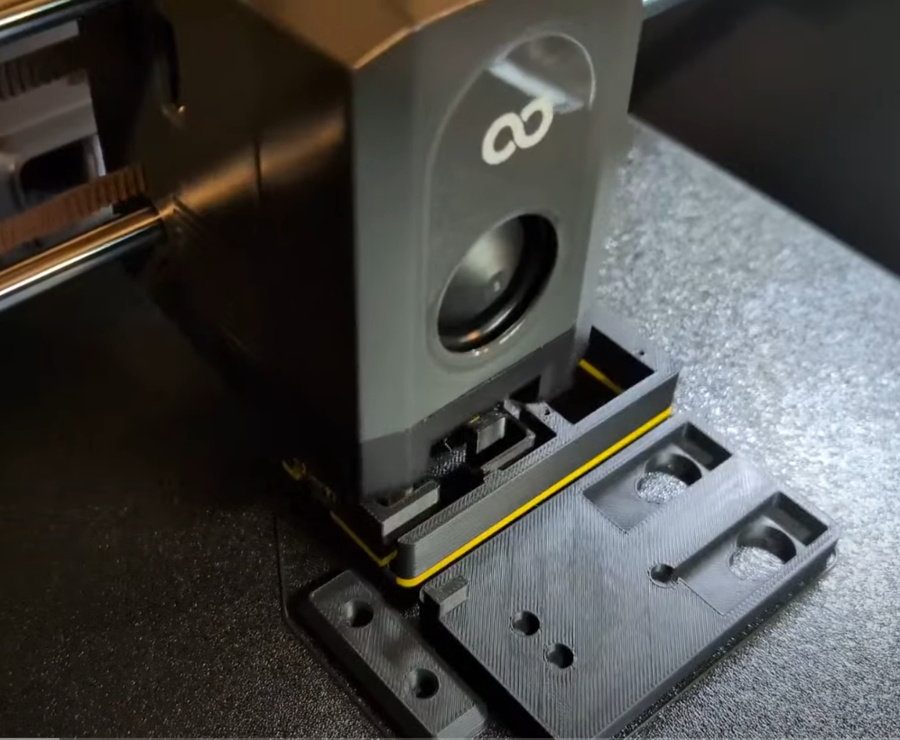
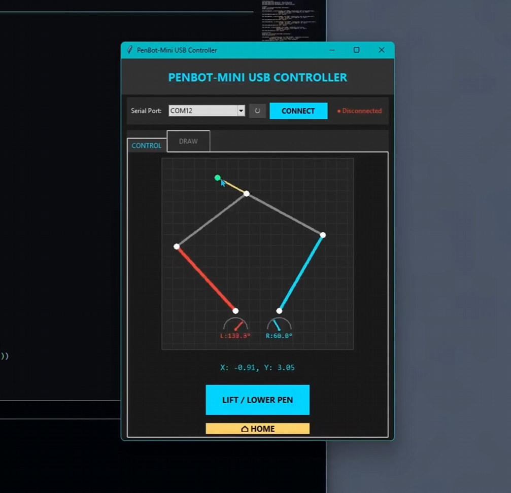
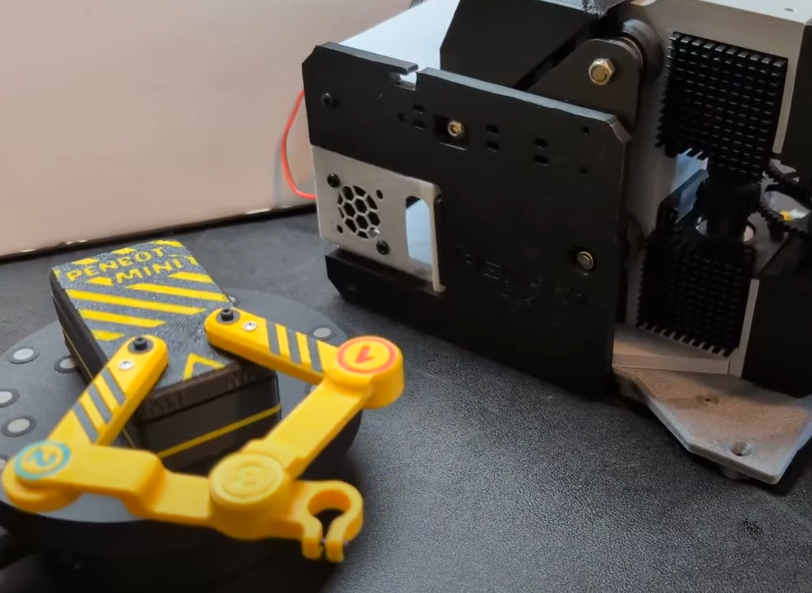

Most drawing robots lean on the same playbook: Cartesian rigs borrowed straight from 3D printers and CNC machines. PenBot never played by those rules. What started as a simple, kind of absurd goal (build a robot to sign a senior yearbook) eventually grew into a toaster-sized portrait artist, and then got shrunk all the way down to the size of a credit card. This is the story of that shrink, the math it forced, and the lessons that came with it.

## From yearbook signatures to Open Sauce

PenBot didn't start as a clean, finished machine. It took four or five major revisions to get anywhere close to working right. The inspiration came from a couple of places: the commercial Line-us robot, and a bit of family history. My dad helped invent the WaterColorBot, which was famously demoed to former President Barack Obama. PenBot picked up that torch with a two-link planar mechanism and coaxial motors, trading Cartesian precision for a much weirder linkage-based approach.

By Open Sauce 2025, PenBot MK4.5 had drawn over 50 vector portraits of attendees. Under the hood it was running a Raspberry Pi 5 with an OpenCV pipeline: grab a face from the webcam, extract the features, convert it all into vector paths the robot could actually draw. It worked, but it wasn't graceful about it. In a high-traffic booth environment, both the Pi and the motors ran hot, and the thing straight-up crashed in front of fellow creator Code Mo. That was the moment it became obvious that big linkage robots can hide a lot of mechanical sloppiness behind software, but they're heavy and a pain to haul around.

## The micro engineering of PenBot Mini

If the original PenBot was about proving the concept could work at all, PenBot Mini is about seeing how far the miniaturization can go. Getting down to credit-card size meant ditching the Ender 3 stepper motors and the Raspberry Pi entirely. In their place: a Seeed Studio XIAO ESP32-C6 board, talking over real-time USB-C to a custom Python desktop app.

At this scale, precision stops being a nice-to-have and becomes the whole game. Half a degree of slop in a tiny servo turns into visible drift on the page. To keep that in check, the five-bar linkage uses miniature bearings built directly into the joints to kill wobble at the source. The chassis and arms are 3D printed on an Elegoo Centauri Carbon 2, using high-quality engineering-grade filament, which is what makes the tight tolerances possible in the first place. A cheap MG90S servo handles the Z-axis lift for multi-line drawings, while two more precise Pettoy servos drive the main arms.

> [!SPONSOR] elegoo
> This build is sponsored by ELEGOO, and the Centauri Carbon 2 did real work here: every chassis part and linkage arm was printed on it. At credit-card scale, dimensional accuracy is the difference between a linkage that draws cleanly and one that grinds itself apart, and that's exactly the tolerance a printer has to hit consistently for PenBot Mini to hold together.
>
> 

## Software that does the heavy lifting

Here's the catch with the mechanical design: the pen tip sits 3/4 of an inch past the final pivot point. That offset sounds small, but it introduces a serious amount of math. To handle it, the ESP32-C6 firmware runs an iterative solver that refines the joint angles up to five times per coordinate just to land the pen where it's supposed to be.

The desktop app isn't just forwarding raw mouse movement either. It resamples every curve into evenly spaced chunks and runs a "ghost simulation" first, checking that the linkage arms won't collide with each other or twist past their limits before a single command gets sent. A 200-command queue buffers everything coming in, and commands execute with a 30-millisecond rate limit so the pen doesn't snag and tear the paper mid-line.

## The paradox of scaling down

Building both versions of PenBot exposed a pattern that shows up a lot in robotics: making something smaller doesn't make the engineering easier, it makes every physical flaw louder. The original PenBot could lean on beefy stepper motors and generous coordinate transforms to paper over its inaccuracies. PenBot Mini doesn't get that luxury. At this size, there's nowhere to hide, and the mechanical build has to be right.

That's really the throughline of this whole project: the future of desktop robotics isn't just smaller electronics, it's pairing precision manufacturing (accurate 3D printing, micro-bearings) with software solvers built specifically to compensate for what the hardware can't.

PenBot Mini still draws with a bit of a charming wobble right now, and that's fine. The next step is adding small reduction gears to mechanically boost precision without blowing up the credit-card footprint.

## Try it yourself

All the code and CAD files for PenBot Mini are on GitHub for anyone who wants to build, tweak, or improve their own pocket-sized plotter. Hackster.io also [covered the build](https://www.hackster.io/news/the-credit-card-sized-drawing-robot-1bf616eea071).

https://www.youtube.com/watch?v=pL0wKQ6DZD0
