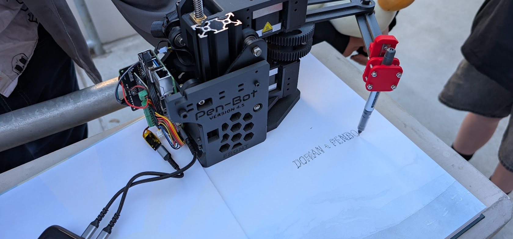
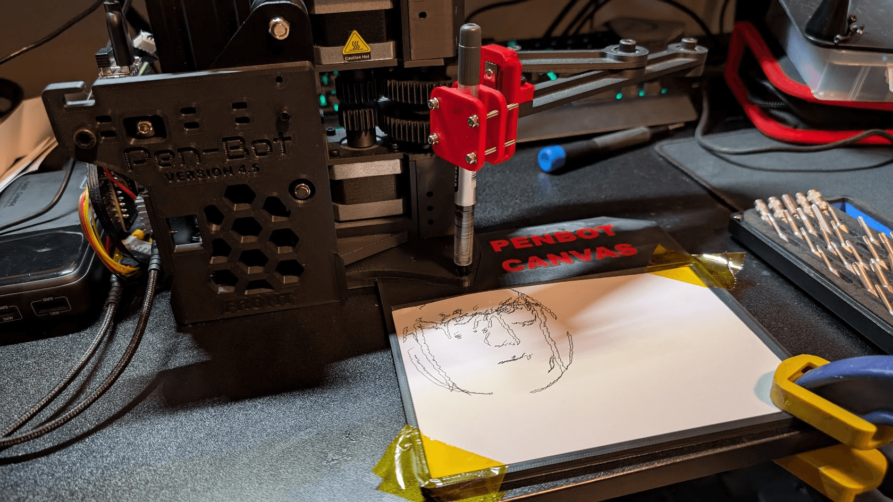
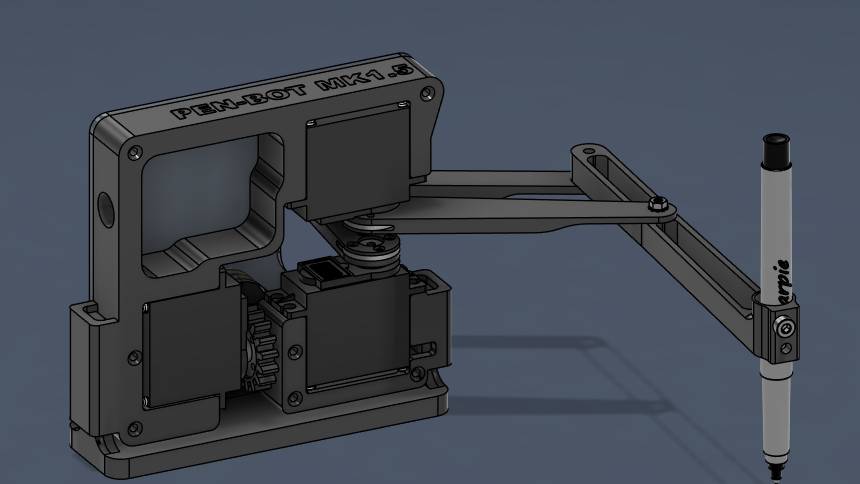
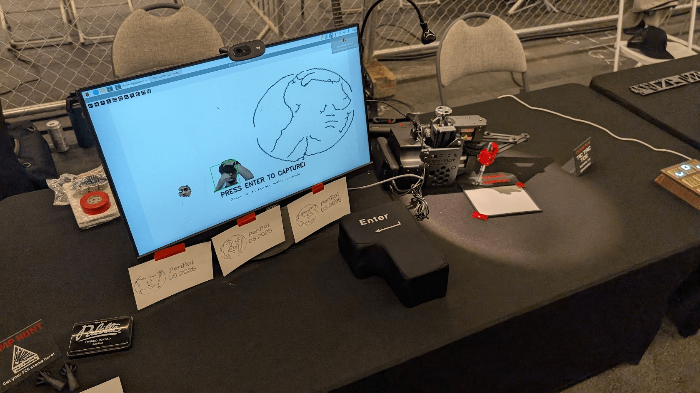
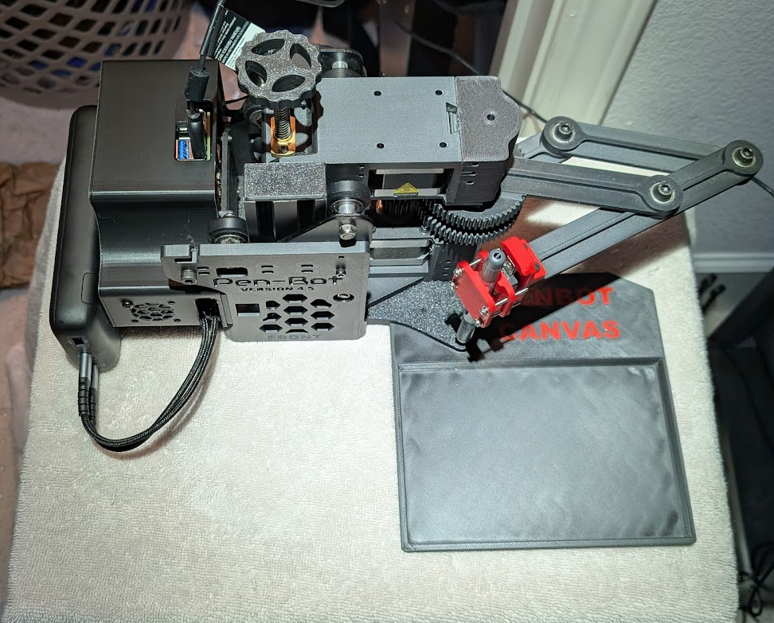

PenBot is a linkage-based drawing robot (plotter) with coaxial motors that converts human faces into vector portraits. Loosely inspired by the [Line-us robot](https://www.line-us.com/) and early line-us clone projects, it evolved through multiple iterations to become a unique artistic machine.

## Origins and goals

Approximately six months ago, I conceived what seemed like an unconventional idea: to sign my senior yearbook with a robot. This approach felt like a fitting and witty signature method, especially given my history of creating robots throughout my academic career. While drawing robots aren't a novel concept—many enthusiasts have developed signature-replicating machines—my personal connection to this field runs deeper than most. My father was heavily involved in the plotter drawing robot community and helped invent the WaterColorBot, one of the earliest painting robots, which was even demonstrated to former President Barack Obama.

## Technical design

### Mechanical system

The robot uses a two-link planar mechanism with coaxial motors. This configuration trades some accuracy for simplicity and a compact design, though the current prototype is fairly large.

Initially, I considered building a basic plotter using 3D printer parts and belts that would move along a gantry system, similar to how a 3D printer operates. However, this approach presented logistical challenges—such a design would require the robot to be at least as large as a yearbook, making it cumbersome to transport between signing sessions.

After extensive research, I discovered the Line-us robot, a commercial version of a compact drawing machine. What fascinated me about this design was its efficiency: it achieved two-dimensional drawing capabilities using only two motors while maintaining a remarkably compact form factor. Following this discovery, I found documentation from someone who had created a clone of this robot, which provided me with a foundational blueprint for my project.

**Key components**

-   Coaxial stepper motors for the two-link arm

-   3D-printed PLA parts using Ender 3 components

-   Electronics enclosure for all control systems

-   Raspberry Pi 5 with webcam support

My plan was ambitious yet straightforward: double all the linkage dimensions from the Line-us design and upgrade to larger servos for increased stability and precision. However, implementation proved significantly more challenging than anticipated. The project underwent approximately 4-5 major revisions, with dramatic differences between the first and fourth versions.

The development journey began with servo motors and extensive software testing. Calculating the proper movements was challenging until Wandian Lee offered his expertise, which considerably streamlined the process. While early prototypes showed promise, we ultimately determined that the servo motors lacked the necessary precision. In retrospect, these issues might have been resolved with additional software calibration, but we opted to explore alternative approaches.

Version 3 employed small stepper motors, but these proved insufficient in terms of torque for our specific application. A breakthrough came when someone donated an Ender 3 3D printer, which provided larger stepper motors. Though this increased PenBot's overall size beyond my initial vision, the change ultimately worked in our favor. Even with these more powerful motors, we needed to implement a gear ratio to achieve the desired accuracy.

As the project neared completion, our focus shifted to optimizing the software to improve drawing quality. We successfully finished the robot just in time to sign yearbooks, meeting our tight deadline despite numerous challenges along the way.

### Mathematics and control

Converting from screen coordinates to the robot's radial system requires complex inverse kinematics. Wandian Lee developed the original math and C code for the coordinate system. The project later transitioned to MicroPython on a Raspberry Pi 5 with Adafruit stepper motor HATs. Much of the refactored python code currently running on the system was created by [James Todd](https://github.com/techninja).

The Desmos calculations show the trigonometric relationships needed to handle coordinate transformations and calculate where the linkage moves the pen.

### Software pipeline

The system uses OpenCV and path tracing libraries to convert faces into drawable vectors.

1.  Webcam captures real-time images

2.  Face detection and feature extraction

3.  Conversion to vector paths optimized for the robot's constraints

4.  Motor control executes the drawing

Each portrait is unique to the person interacting with the project.

https://www.desmos.com/calculator/yp5hnid8xg

## Real-world testing

At OpenSauce 2025, PenBot drew over 50 portraits of expo attendees. The robot performed semi-reliably in a high-traffic environment, though it worked better with a variable power supply than battery power, and had overheating issues with the pi and motors.

## Design trade-offs

The linkage configuration has clear advantages and limitations:

**Pros**

-   Compact mechanical design

-   Uses common 3D printer parts

-   Relatively simple construction

**Cons**

-   Limited drawing accuracy

-   Complex coordinate math required

-   Larger footprint than initially planned

## Development process

The project went through many iterations and revisions. Starting with basic automation concepts, it evolved into a complex system integrating mechanical design, mathematics, computer vision, and real-time control.

## Results

PenBot successfully bridges engineering and art, creating personalized drawings while demonstrating robotics concepts to general audiences. The project shows how technical challenges can evolve into meaningful applications that engage people with both technology and creativity.

