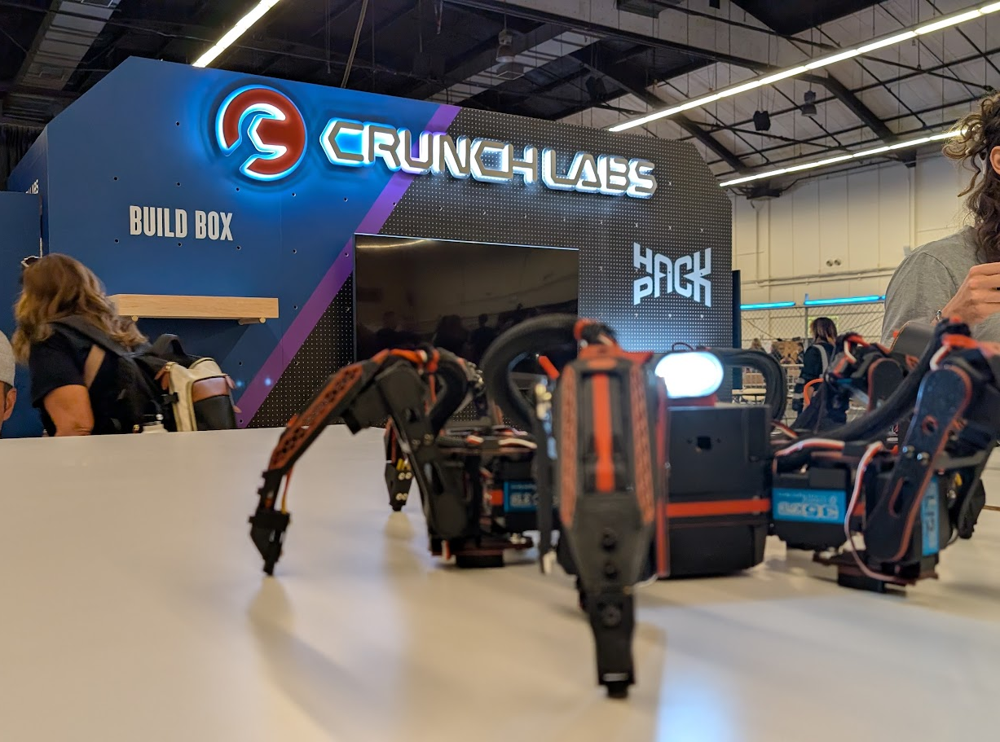
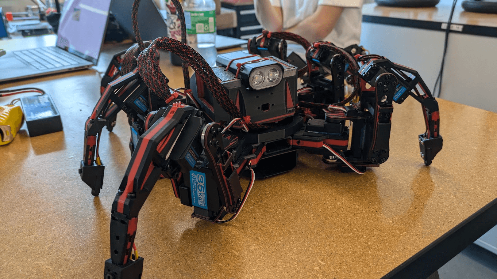
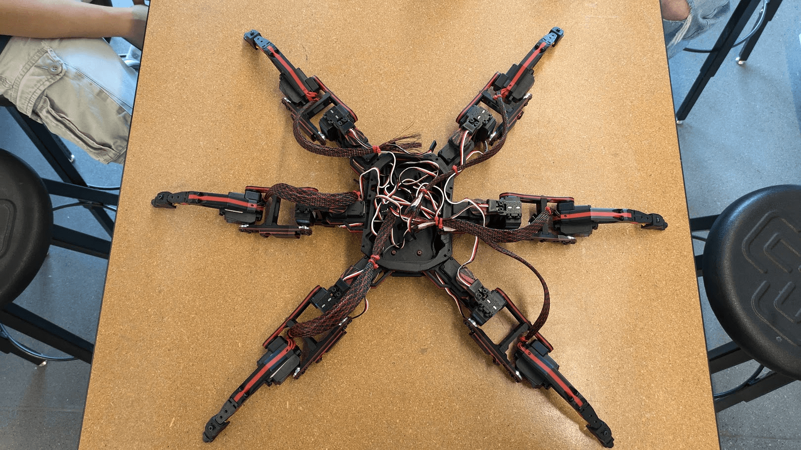
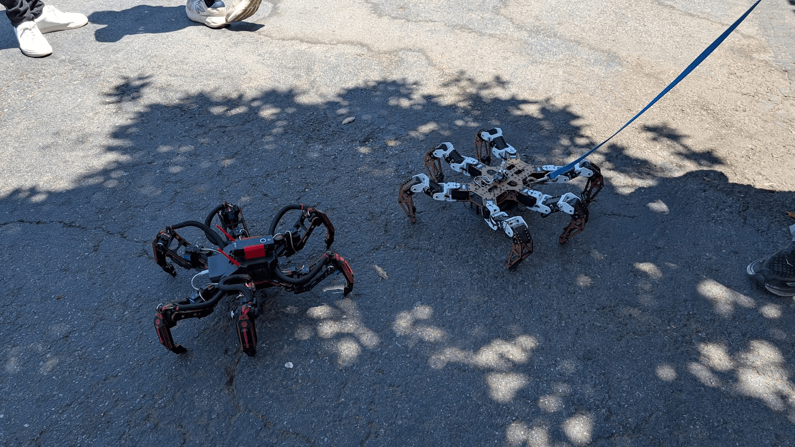
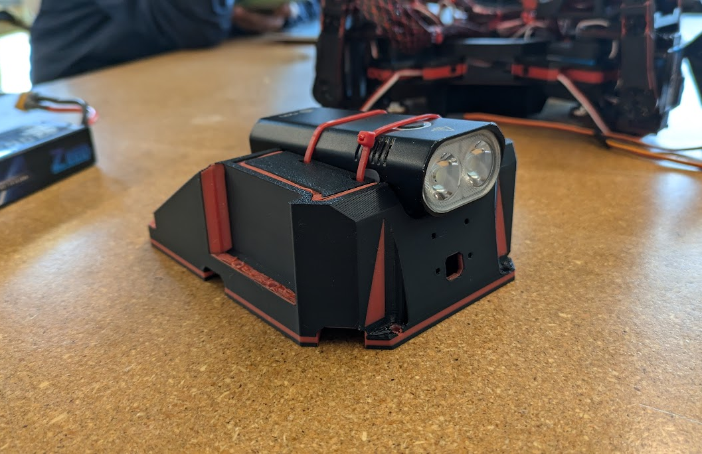
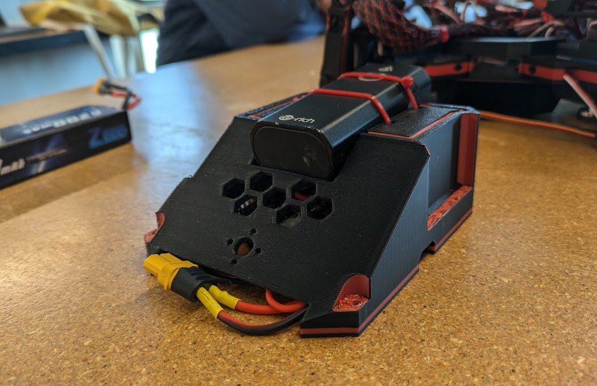
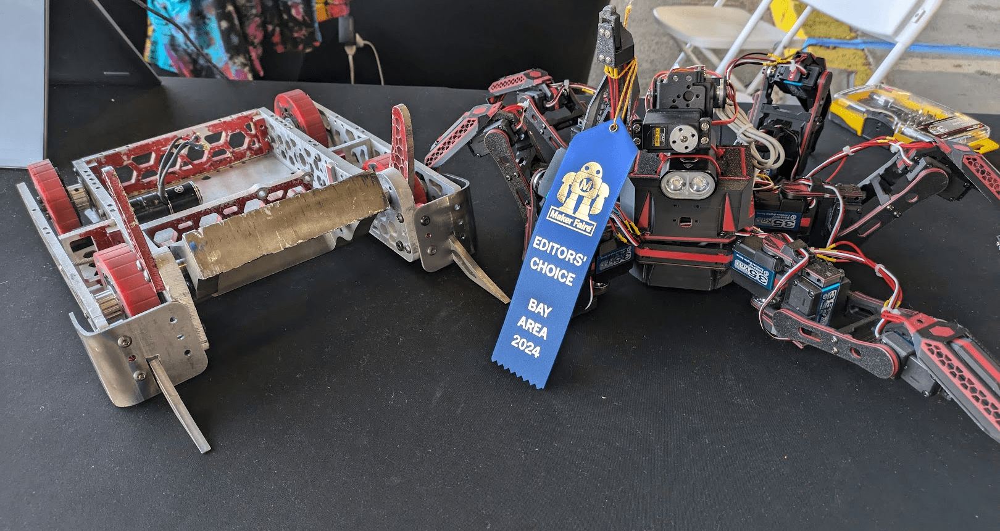
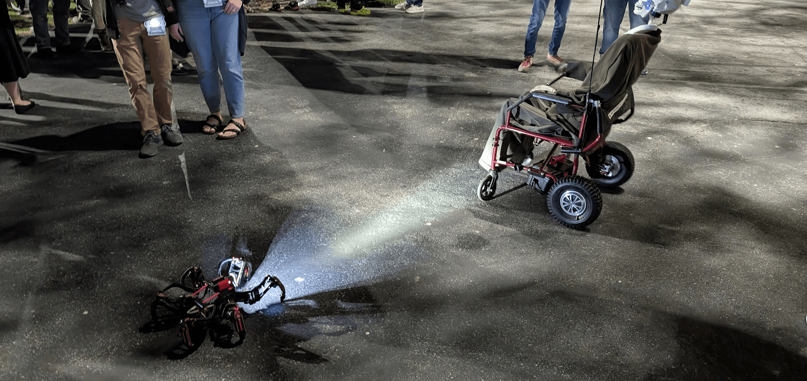

## Overview

The red.HEX is a medium-scale, 18-servo walking hexapod robot developed as a demonstration of design improvement and advanced technological implementation. The project is based on the open-source "Chica" hexapod design but features significant custom engineering, including a redesigned head unit, custom-cast urethane feet, and a future-planned tri-DOF Modular Tail Unit (t-MTU).

This project documents the entire process from manufacturing and assembly to testing and iterative design, showcasing advanced 3D printing, custom electronics, and creative problem-solving.

**Notice:** This project builds upon the excellent open-source work of the "Make Your Pet" repository and the revised frame designs by almelnz2005 and MYP. Full credit is given to the original designers for the foundational software and framework.

## Anatomy and kinematics

A hexapod is a six-legged robot where each leg is controlled independently. In the case of red.HEX, each leg has three degrees of freedom (DOF) controlled by three separate servo motors, allowing for complex, life-like movement.

-   **Coxa:** The joint that connects the leg to the main body (abdomen).

-   **Femur:** The "thigh" of the leg.

-   **Tibia:** The "shin" of the leg, which makes contact with the ground.

With 3 joints per leg, the robot utilizes 18 high-torque servos for locomotion. The inverse kinematics—the complex calculations that translate desired movements into specific joint angles—are run on a connected Android phone using the open-source Chica software.

## The build: from digital to physical

The construction of red.HEX was a multi-stage process involving advanced manufacturing, intricate electronics, and meticulous assembly.

### 3D printing

The project required printing over 100 individual parts. Initial attempts using a high-end Prusa XL 5T printer resulted in continuous print failures. After re-evaluating, a revised set of part files was found that were optimized for reliability.

To meet the challenge, a small "legion" of three Bambu Lab printers (X1 Carbon, P1S, and A1 mini) were run simultaneously. After 48 hours of non-stop printing, all 100+ parts were successfully completed. Approximately 70% of the parts are multi-material, using black and red PLA filament to achieve the robot's signature look.

### Electronics and wiring

The heart of the robot is a Pimoroni Servo 2040 board, an 18-channel controller that interfaces with all the servos, sensors, and power systems. The core components include:

-   **Power:** An 8.4V, 6200mAh Lithium Polymer battery.

-   **Control:** A Pimoroni Servo 2040 controller board.

-   **Switching:** A 5V relay switch to safely control power to the high-torque servos.

-   **Servos:** 18x high-torque, high-speed servos, each capable of exerting roughly 80 lbs of torque.

Each of the 18 servos had to be individually calibrated using a dedicated servo calibrator to ensure precise movement, with the values recorded for the control software.

### Mechanical assembly

Parts are assembled using M3 metric screws and a combination of hex and flat square nuts. The use of square nuts allows screws to anchor against a metal surface inside the 3D-printed parts, creating a much stronger overall build.

An early improvement was replacing the stock plastic servo horns with metal ones to prevent overshoot and increase the durability of the leg joints under the high torque of the servos.

### The modular head unit

The head unit is a major custom component that houses the electronics, provides a mount for the future t-MTU, and dictates the robot's overall aesthetic. The primary design challenge was accommodating the large Android phone required to run the control software.

The first revision served as a functional base for testing but is being iterated upon to improve the form factor and better integrate the phone into the body.

## Final robot and specifications

The fully assembled red.HEX is a large and powerful robot, a testament to the combination of open-source collaboration and individual engineering innovation.

-   **Leg Span:** Approximately 756 mm (30 inches).

-   **Weight:** Fairly heavy, capable of easily moving its own weight.

-   **Torque:** Servos are rated for up to 80 lbs, making the robot's movements powerful and potentially hazardous.

-   **Status:** The base robot is complete and operational, with ongoing work focused on refining the head unit and developing the t-MTU.

