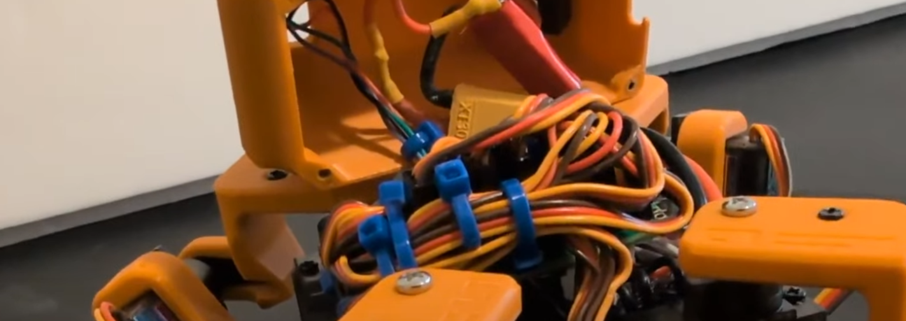
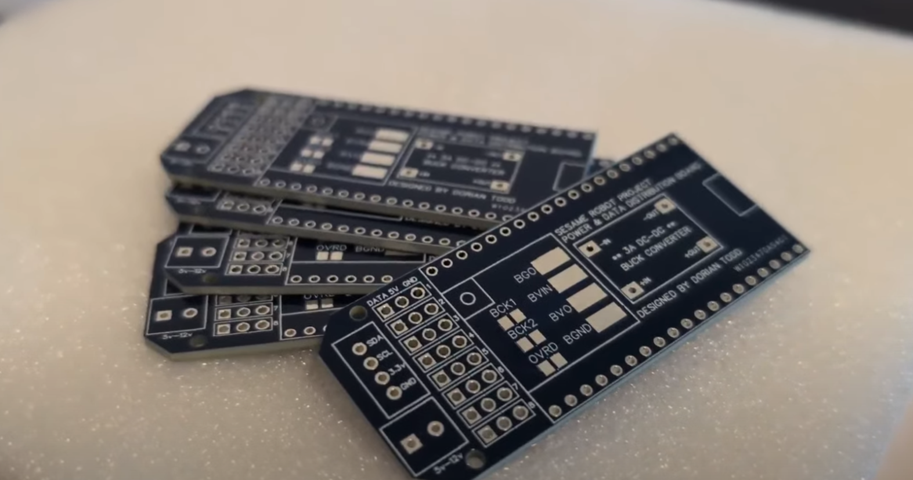
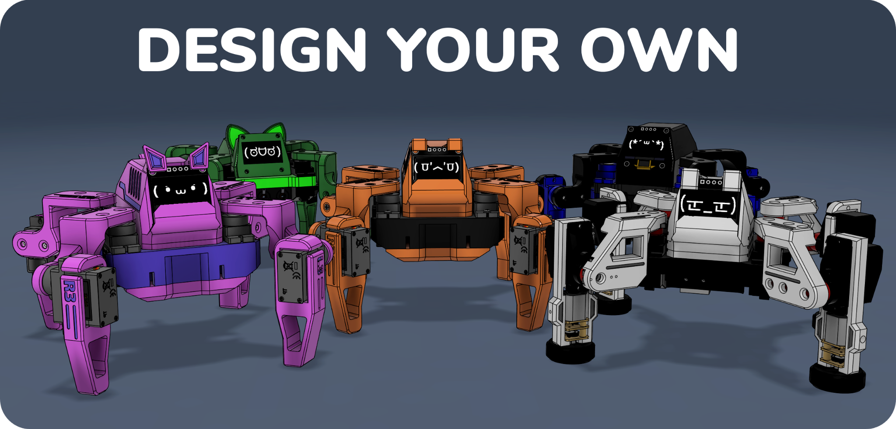

https://www.youtube.com/watch?v=1UDsWkcQZhc

## Overview

Sesame is an open-source walking robot for makers and engineers of every skill level. It's small, it's expressive, and it's cheap enough that building one is a weekend project rather than a financial decision: about $50 to $60 in parts, a 3D printer, some basic soldering, and the Arduino IDE.

It's also grown well past the robot I launched in February 2026. The repository has passed 4,000 stars and roughly 600 forks, there's a community on Discord, pre-flashed build kits, a physics simulator and machine-learning tooling contributed by other people, and a companion app that turns Sesame into a voice assistant with a face.

## Why I built it

It started in December 2025, during a classic late-night doomscrolling session. I found a video of an adorable little quadruped on Bilibili: small, expressive, and clearly a blast to play with. I wanted one immediately.

The source files were locked behind a region wall. I couldn't download them without a verified Chinese account, and I wasn't flying overseas for some STLs. So I designed my own from scratch, with three rules:

1.  **Keep it affordable.** The whole bill of materials stays around $50 to $60.
2.  **Make it expressive.** It needs a face and a personality, not just legs.
3.  **Open source everything.** No region locks, no paywalls. Sesame is Apache 2.0.

I'd built complex robots before, like red.HEX, my 18-servo hexapod, but that project was expensive and a nightmare to assemble. Sesame was meant to be the opposite.

## What Sesame is

| Part | Details |
|---|---|
| Controller | ESP32: Lolin S2 Mini for DIY builds, or the Sesame Distro Board V3 |
| Motion | 8 MG90 180 degree servos, two per leg |
| Face | 128x64 OLED that reacts and animates in sync with movement |
| Frame | Fully 3D printable in PLA with minimal supports |
| Power | 5 V at 3 A: USB-C PD, or a battery and buck converter (V3 supports the Bambu Lab 14500 7.4 V pack) |
| Control | Built-in web UI, JSON API over Wi-Fi, and a serial command line |
| Cost | About $50 to $60 in parts |

It walks, turns, waves, dances, points, rests, does push-ups and the worm, and judges you silently with pixelated eyes.

## Hardware design iterations

Designing a robot that walks is tricky. Designing one that's small, cheap and easy to print is a different headache.

My first concept in Fusion 360 had three servos per leg. It had more freedom of movement, but it looked like a spindly spider and blew the budget. I simplified to two servos per leg, one for the hip and one for the knee, and it's been that way since.

I spent a lot of time making the parts print without supports. The femur links, for example, have squared-off sections instead of rounded ones purely so they lie flat on the bed. The inside of the body is packed tight: a battery, a controller and a nest of wires in a box about the size of a bar of soap. By launch the CAD was on its 71st version.

Along the way I got in touch with Petoi, who make excellent robot dogs. They sent over some higher-end actuators, which led to an experimental fork, Sesame Pro, with legs that accept wheels and better motors without changing the core body. Since then I've also started [Sesame Robot Micro](https://github.com/dorianborian/sesame-robot-micro), an even smaller experimental build with a Seeed XIAO ESP32-C6 Wi-Fi bridge. Unlike the main project it's deliberately rough: fast iteration first, polish later.

## Electronics and the distro board

The first working Sesame used an ESP32-S2 Mini on perfboard. It worked, but the inside was a bird's nest of silicone wire, and asking other people to replicate that felt cruel. So I designed the Sesame Distro Board, a PCB that breaks out all eight servo channels, the I2C bus for the OLED, and power distribution.

The board has been through a few revisions:

-   **Distro Board V3** is the current version. It's pre-flashed with the latest firmware and supports the Bambu Lab battery.
-   **V2** was USB-C only and is now legacy.
-   **V1** was a hat for an ESP32-DevKitC-32E and is also legacy.
-   **Lolin S2 Mini** hand-wired builds are still fully supported, and recommended if you're building from scratch.

> [!SPONSOR] pcbway
> PCBWay made the first batch of Sesame Distro Boards. I sent over the Gerbers and had black-and-gold boards in hand a few days later, and switching from perfboard to a real PCB turned a four-hour wiring session into about twenty minutes of soldering.
>
> 

Powering eight servos at once is the classic trap: if they all move together, the current spike browns out the ESP32 and the robot reboots. The firmware staggers motor activation, and the delay is exposed as `motorCurrentDelay` in the web settings, so if your supply is marginal you can raise it without touching code.

## Firmware, faces and the API

A robot is a plastic brick until you give it code, and I wanted Sesame's to need no app store and no Bluetooth pairing.

Out of the box the robot creates its own access point. Connect a phone to it and a captive portal pops up with the controller: walk, turn, trigger emotes, and adjust settings like calibration and speed. Turn on network mode and Sesame joins your Wi-Fi instead, reachable at `http://sesame-robot.local`.

That network mode is also where the JSON API lives. `GET /api/status` reports the robot's state and current face, and `POST /api/command` takes a movement command, a face, or both, so anything that can make an HTTP request can drive it: Python scripts, JavaScript, home automation. The same commands work over a serial command line for bench testing.

The face is a big part of Sesame's personality. Every emote has matching frames on the OLED, from `walk` and `dance` to `dead` and `worm`, plus an idle animation that blinks on its own. There's also a set of conversational faces, `happy`, `sad`, `angry`, `surprised`, `sleepy`, `love`, `excited`, `confused` and `thinking`, each with a `talk_` variant so the mouth moves while it speaks. Faces are plain 128x64 bitmaps generated with image2cpp, so adding your own is straightforward.

## Sesame Studio

Writing robot animations by hand is painful: set servo 3 to 45 degrees, no, 60. I got tired of guessing and wrote Sesame Studio, a desktop app with a schematic of the robot. You pose the legs visually, capture frames, sequence them into an animation, and it generates the C++ servo angles for the firmware. It turns animation into a stop-motion workflow, and it lives in `software/sesame-studio` in the repository.

## Community projects

Sesame has grown an ecosystem around it, and the parts other people built are the ones I'm proudest of:

-   **[Sesame Companion App](https://github.com/dorianborian/sesame-companion-app):** a Python app that uses the JSON API for voice assistant integration, remote control from anywhere on your network, and faces that change with the conversation.
-   **[Sesame Simulator](https://one-for-all.github.io/sesame-robot-sim/)** by Jay Li: a Rust-based physics simulation that runs in the browser, built on an accurate URDF of the robot, for testing gaits and kinematics without hardware.
-   **[Sesame ML tools](https://github.com/lukehollis/sesame-ml)** by Luke Hollis: a printable, CAD-derived MJCF and URDF description, tasks like standing, recovery, commanded locomotion and navigation, and a policy evaluation and reinforcement learning fine-tuning setup.

## Build your own

Everything is in the repository: CAD and STLs, firmware, Sesame Studio, the bill of materials, and printing, build and wiring guides. There's a full [build tutorial on YouTube](https://www.youtube.com/watch?v=NIgoQVQF_Ng) too.

1.  **Gather parts.** Eight MG90 servos, an S2 Mini or a Distro Board, the OLED, and a power source. The BOM has everything.
2.  **Print the frame.** PLA, minimal supports, about an afternoon.
3.  **Build and wire it.** Follow the build and wiring guides, or use a Distro Board for an easy time.
4.  **Flash the firmware.** Arduino IDE with the ESP32 boards package. Use `ESP32Servo` version 3.0.9: newer releases have a bug where writing one servo can move others. Distro Board kits come pre-flashed.
5.  **Make it yours.** Create animations in Sesame Studio, add faces, or script it over the API.

If you'd rather skip sourcing parts, [build kits](/sesame/kit) are available through Full Contact Engineering when a round is open.

Sesame is meant to be a foundation. Pull requests for better kinematics, new animations, a nicer web UI, and sensor support are very welcome, and I love seeing forks with new hardware and faces. If you build one, come show it off on [Discord](https://discord.gg/XDXkhQd8bC).
